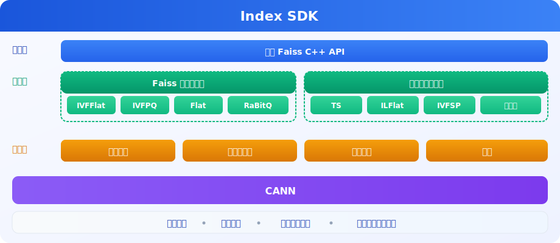

<h1 align="center">IndexSDK</h1>

 
 
 [![Zread](https://img.shields.io/badge/Zread-Ask_AI-_.svg?style=flat&color=0052D9&labelColor=000000&logo=data%3Aimage%2Fsvg%2Bxml%3Bbase64%2CPHN2ZyB3aWR0aD0iMTYiIGhlaWdodD0iMTYiIHZpZXdCb3g9IjAgMCAxNiAxNiIgZmlsbD0ibm9uZSIgeG1sbnM9Imh0dHA6Ly93d3cudzMub3JnLzIwMDAvc3ZnIj4KPHBhdGggZD0iTTQuOTYxNTYgMS42MDAxSDIuMjQxNTZDMS44ODgxIDEuNjAwMSAxLjYwMTU2IDEuODg2NjQgMS42MDE1NiAyLjI0MDFWNC45NjAxQzEuNjAxNTYgNS4zMTM1NiAxLjg4ODEgNS42MDAxIDIuMjQxNTYgNS42MDAxSDQuOTYxNTZDNS4zMTUwMiA1LjYwMDEgNS42MDE1NiA1LjMxMzU2IDUuNjAxNTYgNC45NjAxVjIuMjQwMUM1LjYwMTU2IDEuODg2NjQgNS4zMTUwMiAxLjYwMDEgNC45NjE1NiAxLjYwMDFaIiBmaWxsPSIjZmZmIi8%2BCjxwYXRoIGQ9Ik00Ljk2MTU2IDEwLjM5OTlIMi4yNDE1NkMxLjg4ODEgMTAuMzk5OSAxLjYwMTU2IDEwLjY4NjQgMS42MDE1NiAxMS4wMzk5VjEzLjc1OTlDMS42MDE1NiAxNC4xMTM0IDEuODg4MSAxNC4zOTk5IDIuMjQxNTYgMTQuMzk5OUg0Ljk2MTU2QzUuMzE1MDIgMTQuMzk5OSA1LjYwMTU2IDE0LjExMzQgNS42MDE1NiAxMy43NTk5VjExLjAzOTlDNS42MDE1NiAxMC42ODY0IDUuMzE1MDIgMTAuMzk5OSA0Ljk2MTU2IDEwLjM5OTlaIiBmaWxsPSIjZmZmIi8%2BCjxwYXRoIGQ9Ik0xMy43NTg0IDEuNjAwMUgxMS4wMzg0QzEwLjY4NSAxLjYwMDEgMTAuMzk4NCAxLjg4NjY0IDEwLjM5ODQgMi4yNDAxVjQuOTYwMUMxMC4zOTg0IDUuMzEzNTYgMTAuNjg1IDUuNjAwMSAxMS4wMzg0IDUuNjAwMUgxMy43NTg0QzE0LjExMTkgNS42MDAxIDE0LjM5ODQgNS4zMTM1NiAxNC4zOTg0IDQuOTYwMVYyLjI0MDFDMTQuMzk4NCAxLjg4NjY0IDE0LjExMTkgMS42MDAxIDEzLjc1ODQgMS42MDAxWiIgZmlsbD0iI2ZmZiIvPgo8cGF0aCBkPSJNNCAxMkwxMiA0TDQgMTJaIiBmaWxsPSIjZmZmIi8%2BCjxwYXRoIGQ9Ik00IDEyTDEyIDQiIHN0cm9rZT0iI2ZmZiIgc3Ryb2tlLXdpZHRoPSIxLjUiIHN0cm9rZS1saW5lY2FwPSJyb3VuZCIvPgo8L3N2Zz4K&logoColor=ffffff)](https://zread.ai/Ascend/IndexSDK)
 [![DeepWiki](https://img.shields.io/badge/DeepWiki-Ask_AI-_.svg?style=flat&color=0052D9&labelColor=000000&logo=data:image/png;base64,iVBORw0KGgoAAAANSUhEUgAAACwAAAAyCAYAAAAnWDnqAAAAAXNSR0IArs4c6QAAA05JREFUaEPtmUtyEzEQhtWTQyQLHNak2AB7ZnyXZMEjXMGeK/AIi+QuHrMnbChYY7MIh8g01fJoopFb0uhhEqqcbWTp06/uv1saEDv4O3n3dV60RfP947Mm9/SQc0ICFQgzfc4CYZoTPAswgSJCCUJUnAAoRHOAUOcATwbmVLWdGoH//PB8mnKqScAhsD0kYP3j/Yt5LPQe2KvcXmGvRHcDnpxfL2zOYJ1mFwrryWTz0advv1Ut4CJgf5uhDuDj5eUcAUoahrdY/56ebRWeraTjMt/00Sh3UDtjgHtQNHwcRGOC98BJEAEymycmYcWwOprTgcB6VZ5JK5TAJ+fXGLBm3FDAmn6oPPjR4rKCAoJCal2eAiQp2x0vxTPB3ALO2CRkwmDy5WohzBDwSEFKRwPbknEggCPB/imwrycgxX2NzoMCHhPkDwqYMr9tRcP5qNrMZHkVnOjRMWwLCcr8ohBVb1OMjxLwGCvjTikrsBOiA6fNyCrm8V1rP93iVPpwaE+gO0SsWmPiXB+jikdf6SizrT5qKasx5j8ABbHpFTx+vFXp9EnYQmLx02h1QTTrl6eDqxLnGjporxl3NL3agEvXdT0WmEost648sQOYAeJS9Q7bfUVoMGnjo4AZdUMQku50McDcMWcBPvr0SzbTAFDfvJqwLzgxwATnCgnp4wDl6Aa+Ax283gghmj+vj7feE2KBBRMW3FzOpLOADl0Isb5587h/U4gGvkt5v60Z1VLG8BhYjbzRwyQZemwAd6cCR5/XFWLYZRIMpX39AR0tjaGGiGzLVyhse5C9RKC6ai42ppWPKiBagOvaYk8lO7DajerabOZP46Lby5wKjw1HCRx7p9sVMOWGzb/vA1hwiWc6jm3MvQDTogQkiqIhJV0nBQBTU+3okKCFDy9WwferkHjtxib7t3xIUQtHxnIwtx4mpg26/HfwVNVDb4oI9RHmx5WGelRVlrtiw43zboCLaxv46AZeB3IlTkwouebTr1y2NjSpHz68WNFjHvupy3q8TFn3Hos2IAk4Ju5dCo8B3wP7VPr/FGaKiG+T+v+TQqIrOqMTL1VdWV1DdmcbO8KXBz6esmYWYKPwDL5b5FA1a0hwapHiom0r/cKaoqr+27/XcrS5UwSMbQAAAABJRU5ErkJggg==)](https://deepwiki.com/Ascend/IndexSDK)

## ✨ 最新消息

🔹 **[2026.04.25]**：🚀 [IndexSDK 26.0.0 Release 版本发布](https://gitcode.com/Ascend/IndexSDK/releases/v26.0.0) 
🔹 **[2025.12.30]**：🚀 IndexSDK 开源发布 

## ℹ️ 简介

Index SDK是基于Faiss开发的昇腾NPU异构检索加速框架，针对高维空间中的海量数据，提供高性能的检索，采用与Faiss风格一致的C++语言，结合TBE，Ascendc算子开发，支持ARM和x86_64平台。用户可以在此框架上实现面向应用场景的检索系统。

## ⚙️ 功能介绍

| 功能 | 描述 | 接口 |
| --- | --- | --- |
| [全量检索](./docs/zh/user_guide.md#全量检索) | 支持Flat、Int8Flat等索引类型，对大规模数据集进行精确检索 | [链接](./docs/zh/api/full_retrieval.md) |
| [近似检索](./docs/zh/user_guide.md#近似检索) | 支持IVF、二值化检索等索引类型，提供高效的近似检索能力 | [链接](./docs/zh/api/approximate_retrieval.md) |
| [属性过滤](./docs/zh/user_guide.md#属性过滤检索) | 支持时空库检索，通过属性过滤器对底库进行筛选，提高检索精度 | [链接](./docs/zh/api/attribute_filtering-based_retrieval.md) |
| [批量检索](./docs/zh/user_guide.md#多Index批量检索) | 支持从多个Index库同时执行检索，合并返回TopK结果 | [链接](./docs/zh/api/multi-index_batch_retrieval.md) |
| [其他功能](./docs/zh/user_guide.md#其他功能) | 创建降维对象、提供NPU与CPU之间的索引数据拷贝等功能 | [链接](./docs/zh/api/more_functions.md) |

## 🚀 快速入门

Index SDK提供了一个简单的样例，帮助用户快速体验Index SDK检索流程。详情可参考《[快速入门](./docs/zh/quick_start.md)》。

## 📦 环境部署

Index SDK支持物理机和Docker容器两种部署方式，详情可查看《[安装指南](./docs/zh/installation_guide.md)》。

## 🛠️ 贡献指南

欢迎参与项目贡献，贡献流程和规范请参见《[贡献指南](./CONTRIBUTING.md)》。

## ⚖️ 相关说明

🔹 《[使用指导](./docs/zh/user_guide.md)》 
🔹 《[版本说明](./docs/zh/release_notes.md)》 
🔹 《[许可证声明](LICENSE.md)》 
🔹 《[文档许可证声明](./docs/LICENSE)》 
🔹 《[免责声明](./docs/zh/disclaimer.md)》 
🔹 《[安全加固](./docs/zh/security_hardening.md)》 
🔹 《[附录](./docs/zh/appendix.md)》 

## 🤝 建议与交流

欢迎大家通过以下方式提出问题、交流讨论。

| 资源 | 说明 |
|:--|:--|
| [FAQ](./docs/zh/faq.md) | 常见问题解答与使用答疑 |
| [创建Issue](https://gitcode.com/Ascend/IndexSDK/issues/new) | 提交 Bug、需求或建议 |
| [社区任务](https://gitcode.com/Ascend/IndexSDK/issues) | 查看和认领社区任务 |
| [会议日历](https://meeting.ascend.osinfra.cn/?sig=sig-MindSeriesSDK) | 社区定期例会与活动日程 |
