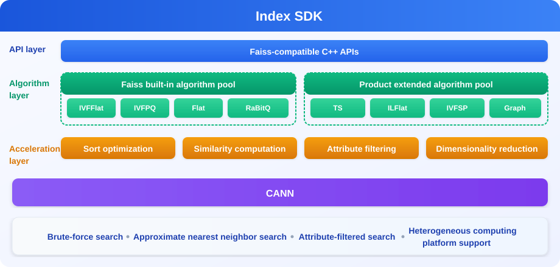

<h1 align="center">Index SDK</h1>

[![Zread](https://img.shields.io/badge/Zread-Ask_AI-_.svg?style=flat&color=0052D9&labelColor=000000&logo=data%3Aimage%2Fsvg%2Bxml%3Bbase64%2CPHN2ZyB3aWR0aD0iMTYiIGhlaWdodD0iMTYiIHZpZXdCb3g9IjAgMCAxNiAxNiIgZmlsbD0ibm9uZSIgeG1sbnM9Imh0dHA6Ly93d3cudzMub3JnLzIwMDAvc3ZnIj4KPHBhdGggZD0iTTQuOTYxNTYgMS42MDAxSDIuMjQxNTZDMS44ODgxIDEuNjAwMSAxLjYwMTU2IDEuODg2NjQgMS42MDE1NiAyLjI0MDFWNC45NjAxQzEuNjAxNTYgNS4zMTM1NiAxLjg4ODEgNS42MDAxIDIuMjQxNTYgNS42MDAxSDQuOTYxNTZDNS4zMTUwMiA1LjYwMDEgNS42MDE1NiA1LjMxMzU2IDUuNjAxNTYgNC45NjAxVjIuMjQwMUM1LjYwMTU2IDEuODg2NjQgNS4zMTUwMiAxLjYwMDEgNC45NjE1NiAxLjYwMDFaIiBmaWxsPSIjZmZmIi8%2BCjxwYXRoIGQ9Ik00Ljk2MTU2IDEwLjM5OTlIMi4yNDE1NkMxLjg4ODEgMTAuMzk5OSAxLjYwMTU2IDEwLjY4NjQgMS42MDE1NiAxMS4wMzk5VjEzLjc1OTlDMS42MDE1NiAxNC4xMTM0IDEuODg4MSAxNC4zOTk5IDIuMjQxNTYgMTQuMzk5OUg0Ljk2MTU2QzUuMzE1MDIgMTQuMzk5OSA1LjYwMTU2IDE0LjExMzQgNS42MDE1NiAxMy43NTk5VjExLjAzOTlDNS42MDE1NiAxMC42ODY0IDUuMzE1MDIgMTAuMzk5OSA0Ljk2MTU2IDEwLjM5OTlaIiBmaWxsPSIjZmZmIi8%2BCjxwYXRoIGQ9Ik0xMy43NTg0IDEuNjAwMUgxMS4wMzg0QzEwLjY4NSAxLjYwMDEgMTAuMzk4NCAxLjg4NjY0IDEwLjM5ODQgMi4yNDAxVjQuOTYwMUMxMC4zOTg0IDUuMzEzNTYgMTAuNjg1IDUuNjAwMSAxMS4wMzg0IDUuNjAwMUgxMy43NTg0QzE0LjExMTkgNS42MDAxIDE0LjM5ODQgNS4zMTM1NiAxNC4zOTg0IDQuOTYwMVYyLjI0MDFDMTQuMzk4NCAxLjg4NjY0IDE0LjExMTkgMS42MDAxIDEzLjc1ODQgMS42MDAxWiIgZmlsbD0iI2ZmZiIvPgo8cGF0aCBkPSJNNCAxMkwxMiA0TDQgMTJaIiBmaWxsPSIjZmZmIi8%2BCjxwYXRoIGQ9Ik00IDEyTDEyIDQiIHN0cm9rZT0iI2ZmZiIgc3Ryb2tlLXdpZHRoPSIxLjUiIHN0cm9rZS1saW5lY2FwPSJyb3VuZCIvPgo8L3N2Zz4K&logoColor=ffffff)](https://zread.ai/Ascend/IndexSDK)
[![DeepWiki](https://img.shields.io/badge/DeepWiki-Ask_AI-_.svg?style=flat&color=0052D9&labelColor=000000&logo=data:image/png;base64,iVBORw0KGgoAAAANSUhEUgAAACwAAAAyCAYAAAAnWDnqAAAAAXNSR0IArs4c6QAAA05JREFUaEPtmUtyEzEQhtWTQyQLHNak2AB7ZnyXZMEjXMGeK/AIi+QuHrMnbChYY7MIh8g01fJoopFb0uhhEqqcbWTp06/uv1saEDv4O3n3dV60RfP947Mm9/SQc0ICFQgzfc4CYZoTPAswgSJCCUJUnAAoRHOAUOcATwbmVLWdGoH//PB8mnKqScAhsD0kYP3j/Yt5LPQe2KvcXmGvRHcDnpxfL2zOYJ1mFwrryWTz0advv1Ut4CJgf5uhDuDj5eUcAUoahrdY/56ebRWeraTjMt/00Sh3UDtjgHtQNHwcRGOC98BJEAEymycmYcWwOprTgcB6VZ5JK5TAJ+fXGLBm3FDAmn6oPPjR4rKCAoJCal2eAiQp2x0vxTPB3ALO2CRkwmDy5WohzBDwSEFKRwPbknEggCPB/imwrycgxX2NzoMCHhPkDwqYMr9tRcP5qNrMZHkVnOjRMWwLCcr8ohBVb1OMjxLwGCvjTikrsBOiA6fNyCrm8V1rP93iVPpwaE+gO0SsWmPiXB+jikdf6SizrT5qKasx5j8ABbHpFTx+vFXp9EnYQmLx02h1QTTrl6eDqxLnGjporxl3NL3agEvXdT0WmEost648sQOYAeJS9Q7bfUVoMGnjo4AZdUMQku50McDcMWcBPvr0SzbTAFDfvJqwLzgxwATnCgnp4wDl6Aa+Ax283gghmj+vj7feE2KBBRMW3FzOpLOADl0Isb5587h/U4gGvkt5v60Z1VLG8BhYjbzRwyQZemwAd6cCR5/XFWLYZRIMpX39AR0tjaGGiGzLVyhse5C9RKC6ai42ppWPKiBagOvaYk8lO7DajerabOZP46Lby5wKjw1HCRx7p9sVMOWGzb/vA1hwiWc6jm3MvQDTogQkiqIhJV0nBQBTU+3okKCFDy9WwferkHjtxib7t3xIUQtHxnIwtx4mpg26/HfwVNVDb4oI9RHmx5WGelRVlrtiw43zboCLaxv46AZeB3IlTkwouebTr1y2NjSpHz68WNFjHvupy3q8TFn3Hos2IAk4Ju5dCo8B3wP7VPr/FGaKiG+T+v+TQqIrOqMTL1VdWV1DdmcbO8KXBz6esmYWYKPwDL5b5FA1a0hwapHiom0r/cKaoqr+27/XcrS5UwSMbQAAAABJRU5ErkJggg==)](https://deepwiki.com/Ascend/IndexSDK)

## ✨ Latest Updates

🔹 **[2026.07.31]**: 🚀 [Index SDK 26.1.0 has been released](https://gitcode.com/Ascend/IndexSDK/releases/v26.1.0) 
🔹 **[2026.04.25]**: 🚀 [Index SDK 26.0.0 has been released](https://gitcode.com/Ascend/IndexSDK/releases/v26.0.0) 
🔹 **[2025.12.30]**: 🚀 Index SDK was released as open source.

## ℹ️ Introduction

Index SDK is a heterogeneous retrieval acceleration framework for Ascend NPUs developed based on Faiss. Designed for large-scale datasets in high-dimensional spaces, it provides high-performance retrieval capabilities. It features a Faiss-style C++ interface, supports operator development using TBE and Ascend C, and runs on both ARM and x86_64 platforms, enabling users to build retrieval systems tailored to their application scenarios.

## ⚙️ Features

| Feature | Description | API |
| --- | --- | --- |
| [Brute-force Search](./docs/en/05_user_guide.md#brute-force-search) | Supports index types such as Flat and Int8Flat for exact retrieval on large-scale datasets. | [Link](./docs/en/api/01_full_retrieval/01_AscendIndex.md#ascendindex) |
| [Approximate Nearest Neighbor Search](./docs/en/05_user_guide.md#approximate-search) | Supports index types such as IVF and binary retrieval to provide efficient approximate nearest neighbor search. | [Link](./docs/en/api/02_approximate_retrieval/01_AscendIndexBinaryFlat.md#ascendindexbinaryflat) |
| [Attribute-Filtered Search](./docs/en/05_user_guide.md#attribute-filter-search) | Supports retrieval from spatiotemporal databases and uses attribute filters to filter the underlying database, improving retrieval accuracy. | [Link](./docs/en/api/03_attribute_filtering-based_retrieval/01_AscendIndexTS.md#ascendindexts) |
| [Batch Search](./docs/en/05_user_guide.md#multi-index-batch-search) | Supports simultaneous search across multiple indexes and combines the returned TopK results. | [Link](./docs/en/api/04_multi-index_batch_retrieval/01_multi-index_batch_retrieval.md#multi-index-batch-retrieval) |
| [Other Functions](./docs/en/05_user_guide.md#other-functions) | Provides functions such as creating dimensionality reduction objects and copying index data between NPUs and CPUs. | [Link](./docs/en/api/05_more_functions/01_IReduction.md#ireduction) |

## 🚀 Quick Start

Index SDK provides a simple example to help users quickly experience the Index SDK retrieval workflow. For details, see [Quick Start](./docs/en/03_quick_start.md).

## 📦 Installation and Deployment

Index SDK supports offline installation, image installation, and source installation. For details, see the [Installation and Deployment](./docs/en/04_installation_guide.md).

## 🛠️ Contribution Guide

Everyone is welcome to contribute to the project. For the contribution process and guidelines, see [Contribution Guide](./CONTRIBUTING.md).

## ⚖️ References

🔹 [User Guide](./docs/en/05_user_guide.md) 
🔹 [Release Notes](./docs/en/release_notes_index.md) 
🔹 [License Statement](LICENSE.md) 
🔹 [Documentation License](./docs/LICENSE) 
🔹 [Disclaimer](./docs/en/disclaimer.md) 
🔹 [Security Hardening](./docs/en/06_security_hardening.md) 
🔹 [Appendix](./docs/en/09_appendix.md) 
🔹 [Third-Party Open-Source Software Notice](Third_Party_Open_Source_Software_Notice)

## 🤝 Suggestions and Feedback

We welcome questions and discussions through the following channels.

| Resource | Description |
| :------- | :---------- |
| [FAQ](./docs/en/07_faq.md) | Frequently asked questions and answers |
| [Create an Issue](https://gitcode.com/Ascend/IndexSDK/issues/create/choose) | Submit bugs, feature requests, or suggestions |
| [Community Tasks](https://gitcode.com/Ascend/IndexSDK/issues/14) | View and claim community tasks |
| [Meeting Calendar](https://meeting.ascend.osinfra.cn/?sig=sig-MindSeriesSDK) | Community regular meetings and event schedules |
