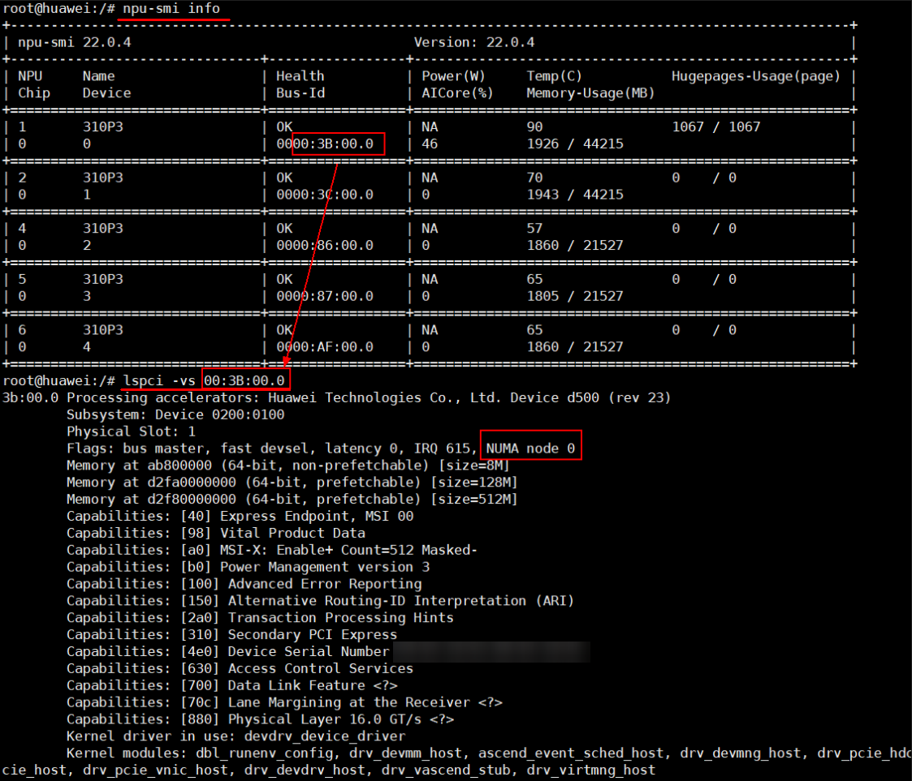
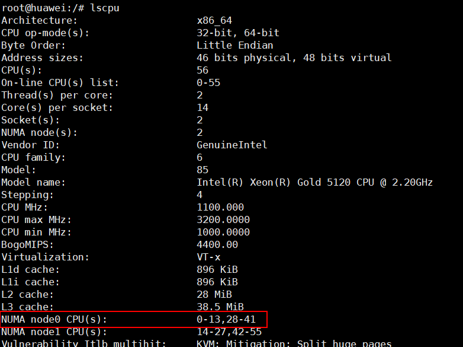

# FAQ<a name="en-us_TOPIC_0000001506414777"></a>

This document provides answers to common questions about Index SDK. You can also refer to [GitCode Issues](https://gitcode.com/Ascend/IndexSDK/issues) for more solutions. If you cannot find an answer, you are welcome to [create an issue](https://gitcode.com/Ascend/IndexSDK/issues/create/choose).

## Common Issues When Upgrading to Faiss 1.10.0<a name="en-us_TOPIC_0000002248120594"></a>

### CMake Error When Compiling Faiss 1.10.0<a name="en-us_TOPIC_0000002287047945"></a>

**Symptom<a name="section428442235616"></a>**

When you compile Faiss 1.10.0, an error message appears with the prompt "CMake 3.24.0 or higher is required".

**Cause<a name="section243812295615"></a>**

The current CMake version is too low. Faiss 1.10.0 requires CMake 3.24.0 or later.

**Solution<a name="section18586112214564"></a>**

Install CMake 3.24.0 or later. The following example uses CMake 3.24.0:

- x86 environment:
    1. Obtain the CMake installation script.

        ```bash
        wget https://github.com/Kitware/CMake/releases/download/v3.24.0/cmake-3.24.0-linux-x86_64.sh
        ```

    2. Run the installation script.

        ```bash
        bash ./cmake-3.24.0-linux-x86_64.sh --skip-license --prefix=/usr
        ```

        ```bash
        # During installation, you may encounter:
        # Select 1.
        Do you accept the license? [y/n]:
        # Enter y.
        # Select 2.
        By default the CMake will be installed in:
          "/usr/cmake-3.24.0-linux-x86_64"
        Do you want to include the subdirectory cmake-3.24.0-linux-x86_64?
        Saying no will install in: "/usr" [Y/n]:
        # Enter n.
        ```

    3. Check the CMake version.

        ```bash
        cmake --version
        ```

        The current CMake version is shown as follows:

        ```text
        cmake version 3.24.0
        ```

- aarch64 environment:
    1. Obtain the CMake installation script.

        ```bash
        wget https://github.com/Kitware/CMake/releases/download/v3.24.0/cmake-3.24.0-linux-aarch64.sh
        ```

    2. Run the installation script.

        ```bash
        bash ./cmake-3.24.0-linux-aarch64.sh --skip-license --prefix=/usr
        ```

        ```bash
        # During installation, you may encounter:
        # Select 1.
        Do you accept the license? [y/n]:
        # Enter y.
        # Select 2.
        By default the CMake will be installed in:
          "/usr/cmake-3.24.0-linux-aarch64"
        Do you want to include the subdirectory cmake-3.24.0-linux-aarch64?
        Saying no will install in: "/usr" [Y/n]:
        # Enter n.
        ```

    3. Check the CMake version.

        ```bash
        cmake --version
        ```

        The current CMake version is shown as follows:

        ```text
        cmake version 3.24.0
        ```

### Performance Degradation of the `update` API After Adding a Large Base Library to `IVFSQT`<a name="en-us_TOPIC_0000002248120594"></a>

**Symptom<a name="section428442235616"></a>**

After upgrading from Faiss 1.7.1 to Faiss 1.10.0, the performance of the `update` API of the IVFSQT algorithm degrades after a large base library is added.

**Cause<a name="section243812295615"></a>**

After a large base library is added, the IVFSQT algorithm uses `IndexFlat` for CPU clustering when the `update` API is called. In Faiss 1.7.1, `IndexFlat` used the `exhaustive_L2sqr_seq` interface. In Faiss 1.10.0, `exhaustive_L2sqr_seq` adds an OpenMP `num_threads(nt)` constraint, which causes the performance degradation.

**Solution<a name="section18586112214564"></a>**

Remove the OpenMP `num_threads(nt)` constraint from the `exhaustive_L2sqr_seq` interface in the Faiss source code, then recompile and install Faiss 1.10.0. In multi-card scenarios, you can set `export OMP_NUM_THREADS=2`.

## Common Issues with Operator Generation<a name="en-us_TOPIC_0000002283337613"></a>

### MemoryError or Multiprocessing Error<a name="en-us_TOPIC_0000002252470708"></a>

**Symptom<a name="section107775370219"></a>**

An error occurs during operator generation, indicating a `MemoryError` or a multiprocessing error.

**Cause<a name="section11777103713218"></a>**

Insufficient resources are available during operator generation.

**Solution<a name="section1477773713218"></a>**

When running the operator generation script, reduce the value of the `-pool` parameter and rerun the script. You can start by setting `-pool 1`.

### The NumPy Data Type `np.float_` Has Been Removed<a name="en-us_TOPIC_0000002252367678"></a>

**Symptom<a name="section428442235616"></a>**

The following error occurs during operator generation:

Failed to import Python module [AttributeError: `np.float_` was removed in the NumPy 2.0 release. Use `np.float64` instead.].

**Cause<a name="section243812295615"></a>**

Python 3.9 and later versions install NumPy 2.0 by default, but CANN versions earlier than 9.0.0 do not currently support NumPy 2.0.

**Solution<a name="section18586112214564"></a>**

Change the NumPy version to 1.26.

```bash
pip3 install numpy==1.26
```

### ATC Error When Generating a Distance Operator<a name="en-us_TOPIC_0000002287047949"></a>

**Symptom<a name="section238219259714"></a>**

When generating a distance operator, ATC reports the following error:

Call InferShapeAndType for nodeXXXX failed

**Cause<a name="section147095251275"></a>**

The new version of CANN has stricter validation, and the `InferDataType` implementation is required.

**Solution<a name="section19641271973"></a>**

You can set the following environment variable as a workaround:

```bash
export IGNORE_INFER_ERROR=1
```

### Memory Allocation Failure<a name="en-us_TOPIC_0000002287001045"></a>

**Symptom<a name="section1227510447314"></a>**

Operator generation fails with the following error: ".../libgomp.so: cannot allocate memory in static TLS block".

**Cause<a name="section1275154417319"></a>**

There is a GCC-related bug in earlier OS versions. For details, see the official description at [link](https://gcc.gnu.org/bugzilla/show_bug.cgi?id=91938).

**Solution<a name="section027514410318"></a>**

Run the following command to set the environment variable:

```bash
export LD_PRELOAD=/path/to/libgomp.so  # Replace /path/to with the actual path of the libgomp.so file.
```

### Operator Generation Fails on Some Operating Systems<a name="en-us_TOPIC_0000002356700501"></a>

**Symptom<a name="section238219259714"></a>**

On some operating systems, operator generation fails with the following error: "fatal error: 'cstdint' file not found" or "fatal error: 'cstdio' file not found".

**Cause<a name="section147095251275"></a>**

Cause 1: For details, see the "Possible Causes" section in the "Error 'fatal error: 'cstdint' file not found' occurs during ATC conversion or model training" chapter of the *CANN Software Installation Guide*.

Cause 2: On some specific systems, this issue stems from differences in toolchain naming conventions across OS distributions. When building operators, the Ascend CANN software stack searches by default for the standard `aarch64-linux-gnu` toolchain directory to obtain C++ standard library header files. However, on some specific operating systems (kylin, openEuler, and ctyunos), the toolchain directory is renamed (for example, to `aarch64-kylin-linux`) to distinguish specific system ABIs. Because the CANN compiler cannot find the corresponding header files in the default path, compilation fails.

**Solution<a name="section19641271973"></a>**

You need to manually add the actual C++ header file path of your system to the `CPLUS_INCLUDE_PATH` environment variable so that the compiler can find the correct files. Taking a Kylin system with GCC 12 as an example, run the following command:

```bash
export CPLUS_INCLUDE_PATH=/usr/include/c++/12/aarch64-kylin-linux:/usr/include/c++/12:$CPLUS_INCLUDE_PATH
```

## Common Issues During Inference<a name="en-us_TOPIC_0000002283277033"></a>

### Segmentation Fault or TBE Error When the Program Exits<a name="en-us_TOPIC_0000002252470712"></a>

**Symptom<a name="section428442235616"></a>**

After the retrieval process finishes, an error is reported when the program exits, with messages such as "segmentation fault" or a TBE error.

**Cause<a name="section243812295615"></a>**

Another component in the service process may be using ACL resources and calling `aclFinalize` to release them, causing the ACL resources to be released twice.

**Solution<a name="section18586112214564"></a>**

You can set the `MX_INDEX_FINALIZE` environment variable to `0` so that Index SDK does not call `aclFinalize`. Setting it to `1` means that `aclFinalize` is still called. Other values are invalid.

You must ensure that `aclFinalize` is called once to release the resources when the process exits. Otherwise, an error may still occur when the process exits.

### Performance Fluctuation When the Query Count Exceeds 1,000<a name="en-us_TOPIC_0000002252367682"></a>

**Symptom<a name="section7388731387"></a>**

When you run a query operation, performance fluctuates if the number of queries exceeds 1,000.

**Cause<a name="section2012040380"></a>**

During concurrent processing on the host CPU, tasks may be scheduled to non-affine CPU cores, increasing the processing time.

**Solution<a name="section277318351005"></a>**

Bind the retrieval application to specific CPU cores. The procedure is as follows.

1. Obtain the corresponding NUMA node information. As shown in [Figure 1](#fig7992105655611), the NPU being queried belongs to "NUMA node 0".

   **Figure 1** Obtaining NUMA node information<a id="fig7992105655611"></a>
   

2. Use **lscpu** to view the CPU core information for NUMA node 0. As shown in [Figure 2](#fig1614971412517), the CPU cores for "NUMA node 0" are "0-13,28-41".

   **Figure 2** Using the command to confirm CPU core information<a id="fig1614971412517"></a>
   

3. Bind the retrieval application to the confirmed CPU cores. The command is as follows:

    ```bash
    taskset -c 0-13,28-41 ./mxIndexApp
    ```

    `mxIndexApp` is the retrieval application to bind. Replace it with the actual application name.

## Common Issues During Compilation<a name="en-us_TOPIC_0000002248358794"></a>

### `libascendfaiss.so` Not Found<a name="en-us_TOPIC_0000002287047953"></a>

**Symptom<a name="section238219259714"></a>**

During compilation, the prompt `libascendfaiss.so not found` appears.

**Cause<a name="section147095251275"></a>**

The `libascendfaiss.so` file cannot be found in the paths specified by the environment variables.

**Solution<a name="section19641271973"></a>**

Verify the path of `libascendfaiss.so` in the `host/lib` directory of the installation package, and add the path to the `LD_LIBRARY_PATH` environment variable.

### Undefined Reference Error When Linking `libfaiss.so`<a name="en-us_TOPIC_0000002287001049"></a>

On an openEuler 22.03 (LTS) system, after you compile and install Faiss using the system-default CMake and `gcc`, an **undefined reference** error is returned when linking `libfaiss.so`.

**Cause<a name="section5819920577"></a>**

The CMake installed by default or through the `yum` tool on the openEuler 22.03 (LTS) system has a compatibility issue.

**Solution<a name="section1165542813712"></a>**

Visit the component's official website to obtain the source code for the corresponding CMake version, then recompile and install it.

## IVFRaBitQ Retrieval Recall Issues<a name="ivfrabitq-recall-low-nlist-10048"></a>

### AscendIndexIVFRaBitQ Has Significantly Lower Recall Than the CPU with `nlist=10048`<a name="ivfrabitq-recall-low-symptom"></a>

**Symptom<a name="ivfrabitq-recall-low-symptom-section"></a>**

When using AscendIndexIVFRaBitQ, if `coarse_centroid_num` (`nlist`) is set to `10048` or another value greater than `2512`, the `recall@K` of NPU search after `copyFrom` is significantly lower than the CPU baseline. The control group with `nlist ≤ 8192` may work normally.

**Cause<a name="ivfrabitq-recall-low-cause"></a>**

Common root causes include:

1. **Inconsistent GEMM tiling and multi-core partitioning in the `RotateAndL2AtFP32` operator:** Only the first approximately `2512` coarse centroid rows (the batch size of a single AIC core) are correctly rotated and written to the device, while rows greater than or equal to `2512` are zero, causing IVF coarse-search probe selection to fail.
2. **8192-code tile boundary issue in the L1 distance operator:** The query norm term is missing from the distance calculation for the second and subsequent tiles.
3. **The custom OPP has not been recompiled and deployed:** The old operator is still used after the host tiling or kernel is modified.

**Solution<a name="ivfrabitq-recall-low-fix"></a>**

1. Verify that the relevant fixes have been applied and **recompile and deploy** the custom OPP.
2. Use runtime diagnostics to locate the issue step by step:

    ```bash
    # Step 1: Verify coarse center upload (copyFrom stage)
    export IVFRABITQ_VERIFY_COARSE_CENTER=1
    # Run the copyFrom scenario and check whether zeroRowsAfter2512 is 0

    # Step 2: If the centroids are correct, check the L1 probe distribution (search stage)
    export IVFRABITQ_DEBUG_L1_PROBE=stats
    # Verify that in[8192,nlist) > 0 (depending on the data distribution)

    # Step 3: Perform an in-depth comparison of L1 distances around the 8192 boundary
    export IVFRABITQ_VERIFY_L1_DIST=1
    ```

3. For complete instructions, see [Common Operations — IVFRaBitQ Runtime Diagnostics](./08_common_operations.md#ivfrabitq-runtime-debug).

## Floating-Point Computation Precision Issues

### NPU Clustering Results Are Not Completely Consistent with CPU Clustering Results

During clustering, the distances from some points to two cluster centers are almost equal. Due to floating-point calculation errors on the order of one part per million (for details about the Faiss CPU version, see [https://github.com/facebookresearch/faiss/issues/297](https://github.com/facebookresearch/faiss/issues/297)), the cluster assignment of these vectors may be uncertain. This error is amplified after multiple iterations, so NPU clustering results are not completely consistent with CPU clustering results. When comparing results with the CPU, use CPU clustering consistently.
