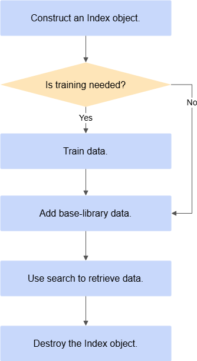
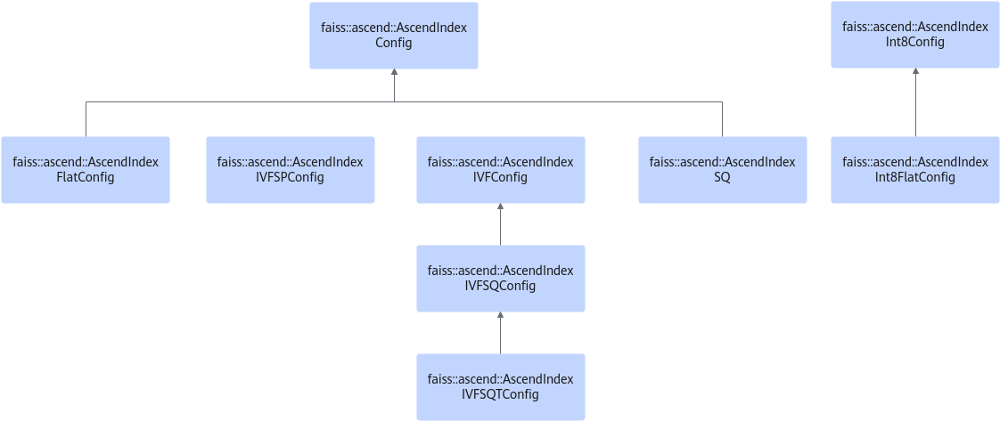
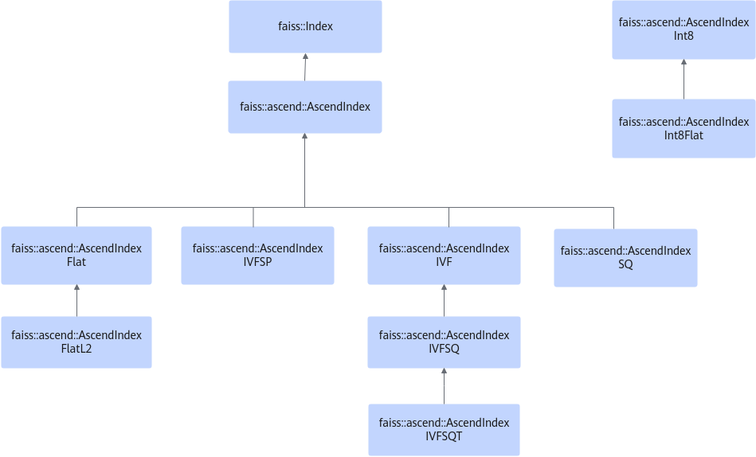

# API Reference

|Category|Link|
|--|--|
|Full retrieval|[full_retrieval](./full_retrieval.md)|
|Approximate retrieval|[approximate_retrieval](./approximate_retrieval.md)|
|Attribute filtering retrieval|[attribute_filtering-based_retrieval](./attribute_filtering-based_retrieval.md)|
|Multi-index batch retrieval|[multi-index_batch_retrieval](./multi-index_batch_retrieval.md)|
|Other functions|[more_functions](./more_functions.md)|
|Unused APIs|[unused_apis](./unused_apis.md)|
|API return value reference|[return_code_reference](./return_code_reference.md)|

## API Changes

This section describes API changes, including additions, modifications, deletions, and retirement notices. API changes reflect only code-level changes. They do not include improvements to the document itself, such as language, format, or links.

- Added: Indicates an API added in this version.
- Modified: Indicates that the API changed compared with the previous version.
- Deleted: Indicates that the API was deleted in this version.
- Retirement notice: Indicates that the API stops evolving starting from the version in which the retirement notice is issued, and it is retired and removed one year later.

|Class Name/API Prototype|Change Type|Change Description|Version|
|--|--|--|--|
|The [Init](./full_retrieval.md#init) `AscendIndexCluster`|Modified|The `resourceSize` variable in the `Init` API of the `AscendIndexCluster` algorithm uses the default value 128 MB.|6.0.RC2|
|Constructor of `AscendIndexBinaryFlat`|Modified|The `AscendIndexBinaryFlat` constructor adds the `usedFloat` parameter, which improves the performance of the retrieval mode that stores binary features and uses float features for retrieval, namely, the `search` API.|6.0.RC2|
|The [search](./approximate_retrieval.md#search) `AscendIndexBinaryFlat`|Added|`AscendIndexBinaryFlat` adds support for the retrieval mode in which binary features are stored and float features are used for retrieval.|6.0.RC2|
|[AscendIndexInt8FlatConfig](./full_retrieval.md#ascendindexint8flatconfig) `AscendIndexInt8Flat` (Table 2)|Modified|The value of `resourceSize` cannot exceed 16 \* 1024 MB (16 \* 1024 \* 1024 \* 1024 bytes).|6.0.RC3|
|[AscendIndexInt8FlatConfig](./full_retrieval.md#ascendindexint8flatconfig) `AscendIndexInt8Flat` (Table 3)|Modified|The value of `resourceSize` cannot exceed 16 \* 1024 MB (16 \* 1024 \* 1024 \* 1024 bytes).|6.0.RC3|
|The [Init](./attribute_filtering-based_retrieval.md#init) `AscendIndexTS`|Modified|Changes the constraints on the `maxFeatureRowCount` parameter.|6.0.RC3|
|The [setPageSize](./full_retrieval.md#setpagesize) `AscendIndexInt8Flat`|Added|Sets the number of consecutive base-library blocks that `AscendIndexInt8Flat` computes in a single `search` call.|6.0.RC3|
|[InitWithExtraVal](./attribute_filtering-based_retrieval.md#initwithextraval) `AscendIndexTS`|Added|Initialization function for an instance with extra attributes.|6.0.RC3|
|[AddWithExtraVal](./attribute_filtering-based_retrieval.md#addwithextraval) `AscendIndexTS`|Added|API for adding features with additional attributes.|6.0.RC3|
|[GetBaseByRangeWithExtraVal](./attribute_filtering-based_retrieval.md#getbasebyrangewithextraval) `AscendIndexTS`|Added|Queries the base library with additional attributes by range.|6.0.RC3|
|[GetExtraValAttrByLabel](./attribute_filtering-based_retrieval.md#getextravalattrbylabel) `AscendIndexTS`|Added|Obtains the attributes of the specified label feature.|6.0.RC3|
|[ExtraValAttr](./attribute_filtering-based_retrieval.md#extravalattr) `AscendIndexTS`|Added|Additional attribute information.|6.0.RC3|
|[ExtraValFilter](./attribute_filtering-based_retrieval.md#extravalfilter) `AscendIndexTS`|Added|Additional attribute filter.|6.0.RC3|
|The [setRemoveFast](./approximate_retrieval.md#setremovefast) `AscendIndexBinaryFlat`|Added|Sets whether `AscendIndexBinaryFlat` quickly deletes vectors from the base library.|6.0.RC3|
|[AscendIndexVStar](./approximate_retrieval.md#ascendindexvstar) | Added | Adds the new `AscendIndexVStar` algorithm.|6.0.RC3|
|[AscendIndexGreat](./approximate_retrieval.md#ascendindexgreat) | Added | Adds the new `AscendIndexGreat` algorithm.|6.0.RC3|
|The [setSearchParams](./approximate_retrieval.md#setsearchparams) `AscendIndexIVFSQT`|Added|Sets the parameters that affect retrieval accuracy and performance.|6.0.RC3|
|The [setNumProbes](./approximate_retrieval.md#setnumprobes) `AscendIndexIVFSQT`|Retirement notice|Expected to be deprecated in September 2025. Use `setSearchParams` instead.|6.0.RC3|
|The [updateTParams](./approximate_retrieval.md#updatetparams) `AscendIndexIVFSQT`|Retirement notice|Expected to be deprecated in September 2025. Use `setSearchParams` instead.|6.0.RC3|
|The [SetSaveHostMemory](./attribute_filtering-based_retrieval.md#setsavehostmemory) `AscendIndexTS`|Added|Sets the API for using the host-memory-saving mode.|6.0.0|
|The [add](./full_retrieval.md#add) `AscendIndex`|Added|The Flat algorithm newly supports ingesting FP16 data into the base library.|6.0.0|
|The [add_with_ids](./full_retrieval.md#add_with_ids) `AscendIndex`|Added|The Flat algorithm newly supports ingesting FP16 data into the base library with IDs.|6.0.0|
|The [search](./full_retrieval.md#search) `AscendIndex`|Added|The Flat algorithm newly supports FP16 retrieval.|6.0.0|
|The [search_with_masks](./full_retrieval.md#search_with_masks) `AscendIndexFlat`|Added|The Flat algorithm newly supports FP16 retrieval with masks.|6.0.0|
|The [AscendIndexIVFSP](./approximate_retrieval.md#ascendindexivfsp) `AscendIndexIVFSP`|Added|Constructor for the shared-codebook mode.|6.0.0|
|The [saveAllData](./approximate_retrieval.md#savealldata) `AscendIndexIVFSP`|Added|Stores IVFSP data in memory.|6.0.0|
|The [loadAllData](./approximate_retrieval.md#loadalldata-api) `AscendIndexIVFSP`|Added|Restores IVFSP from memory.|6.0.0|

## Calling Process and Inheritance Relations

> [!NOTE]
> The C++ APIs of the Index SDK feature retrieval component follow the exception handling mechanism of the open-source Faiss API. Therefore, you must call them within `try`/`catch` blocks and handle exceptions there. For a detailed example, see the handling method in [Code Reference](../appendix.md#code-reference). This prevents program exits caused by exceptions during use.

The basic process for calling retrieval APIs is shown in [Figure 1 Basic process for calling retrieval APIs](#fig7270141171511).

**Figure 1** Basic process for calling retrieval APIs

Feature retrieval inherits from `Index` in Faiss and supports multiple retrieval indexes. It provides APIs for building, querying, and deleting a base library. The inheritance relations among the objects are shown in [Figure 2 Inheritance relations among some AscendIndexConfig classes](#fig1028942114236) and [Figure 3 Inheritance relations among some AscendIndex classes](#fig13557318153512).

**Figure 2** Inheritance relations among some AscendIndexConfig classes

**Figure 3** Inheritance relations among some AscendIndex classes

> [!NOTE]
>
>- Because some feature retrieval inputs use pointer types, ensure that these pointers are valid. Otherwise, potential issues such as out-of-bounds reads or writes may occur during feature retrieval. In addition, feature retrieval helps the Ascend AI Processor perform vector retrieval computation, so you must ensure that the input Device ID is valid. Otherwise, the function may fail because the device connection fails.
>- [Faiss](https://github.com/facebookresearch/faiss) is a widely used vector retrieval acceleration library in the industry. To help ecosystem users quickly migrate vector retrieval clustering services from CPU/GPU platforms to the Ascend platform, the `AscendIndex` base class for many algorithms on the Ascend platform inherits from the `faiss::Index` class. The member variables `d` and `ntotal` in `faiss::Index` are public. When you use `AscendIndex` and its `AscendIndexInt8` subclasses, do not modify these public member variables directly.
>- This document no longer describes the member functions and variables of the base class `faiss::Index`.
>- For the `resourceSize` variable in the `Config` class, its purpose is to reserve memory for intermediate results during feature retrieval. The unit is bytes. You are advised to increase it when the base-library features are large, for example, more than 3 million, and the number of query requests is large. This helps avoid performance fluctuations caused by temporary memory allocation during retrieval. You are advised to set it to 1024 \* 1024 \* 1024 bytes.
>- When you create a new `Index`, the system compares it with the requested `resources`. If there is a difference, it releases the original memory resources and requests new ones according to the latest `Index` resources. You are advised to keep the overall `resources` value of the `Index` consistent.
>- You can set the operator execution timeout by setting the `MX_INDEX_SYNCHRONIZE_STREAM_TIME` environment variable. The unit is ms, and the value range is [60000, 1800000]. The default value is 300000.

## Header Files

**Table 1** Header files

|Header File Name|Directory|Purpose|
|--|--|--|
|AscendCloner.h|${mxIndex_install_path}/mxIndex/include/faiss/ascend/|This header file provides the operation for copying retrieval `Index` resources from the NPU to Faiss on the CPU side. The copy process occurs in memory. Data loaded on the original NPU `Index` is copied to CPU-side memory, which makes it easy to use the same base library for retrieval on the CPU.|
|AscendClonerOptions.h|${mxIndex_install_path}/mxIndex/include/faiss/ascend/|Provides configuration options.|
|AscendIndex.h|${mxIndex_install_path}/mxIndex/include/faiss/ascend/|`AscendIndex` is the base class for most retrieval `Index` implementations in the feature retrieval component. It sits on top of Faiss and defines APIs for other indexes in feature retrieval.|
|AscendIndexBinaryFlat.h|${mxIndex_install_path}/mxIndex/include/faiss/ascend/|This header file provides the Hamming-distance API class and defines the external Hamming-distance APIs.|
|AscendIndexCluster.h|${mxIndex_install_path}/mxIndex/include/faiss/ascend/|External APIs of `AscendIndexCluster`.|
|AscendIndexFlat.h|${mxIndex_install_path}/mxIndex/include/faiss/ascend/|This class mainly provides external APIs for Flat-FP16.|
|AscendIndexIVF.h|${mxIndex_install_path}/mxIndex/include/faiss/ascend/|`AscendIndexIVF` is the base class for approximate retrieval and cannot be used directly.|
|AscendIndexIVFSP.h|${mxIndex_install_path}/mxIndex/include/faiss/ascend/|Provides the external APIs for IVFSP. The core APIs include `add`, `add_with_ids`, `search`, and `search_with_filter`.|
|AscendIndexIVFSQ.h|${mxIndex_install_path}/mxIndex/include/faiss/ascend/|External APIs for IVFSQ, including `train`, `copyto`, `copyfrom`, and the constructor.|
|AscendIndexInt8.h|${mxIndex_install_path}/mxIndex/include/faiss/ascend/|`AscendIndex` is the base class for int8-type indexes in the feature retrieval component. It sits on top of Faiss and defines APIs for `IndexInt8Flat`.|
|AscendIndexInt8Flat.h|${mxIndex_install_path}/mxIndex/include/faiss/ascend/|This class mainly provides external APIs for Flat-Int8.|
|AscendIndexSQ.h|${mxIndex_install_path}/mxIndex/include/faiss/ascend/|External API definitions for SQ retrieval.|
|AscendIndexTS.h|${mxIndex_install_path}/mxIndex/include/faiss/ascend/|External APIs for the spatiotemporal library, including the Hamming, `Int8Flat`, and `FP16Flat` algorithms.|
|AscendMultiIndexSearch.h|${mxIndex_install_path}/mxIndex/include/faiss/ascend/|Provides the external APIs for multi-index retrieval.|
|AscendNNInference.h|${mxIndex_install_path}/mxIndex/include/faiss/ascend/|External APIs for neural-network dimensionality reduction.|
|AscendIndexIVFSQT.h|${mxIndex_install_path}/mxIndex/include/faiss/ascend/custom|Contains the three-level IVFSQ retrieval algorithm with dimensionality reduction and fuzzy clustering. It reclusters each cluster. First it selects `nprobe` clusters based on the first-level clustering results. Then it selects `l2nprobe` clusters from all second-level clusters, and then it performs precise retrieval.|
|IReduction.h|${mxIndex_install_path}/mxIndex/include/faiss/ascend/custom|`IReduction` is the unified API for dimensionality reduction methods in the feature retrieval component. It currently supports the `PCAR` and `NN` dimensionality-reduction algorithms.|
|Version.h|${mxIndex_install_path}/mxIndex/include/faiss/ascend/utils|API for obtaining version information.|
|ErrorCode.h|${mxIndex_install_path}/mxIndex/device/include|Contains Index SDK error code information.|
|IndexILFlat.h|${mxIndex_install_path}/mxIndex/device/include|External API definition of `IndexILFlat`.|
|IndexIL.h|${mxIndex_install_path}/mxIndex/device/include|Base class for `IndexILFlat`. It cannot be used directly.|
|AscendIndexGreat.h|${mxIndex_install_path}/mxIndex/include/faiss/ascend/|External API definition for Great retrieval.|
|AscendIndexVStar.h|${mxIndex_install_path}/mxIndex/include/faiss/ascend/|External API definition for VStar retrieval.|
|AscendIndexMixSearchParams.h|${mxIndex_install_path}/mxIndex/include/faiss/ascend/|External header file for the parameter structures required by VStar and Great retrieval.|

> [!NOTE]
>
>${mxIndex_install_path} indicates the installation path of Index SDK.
