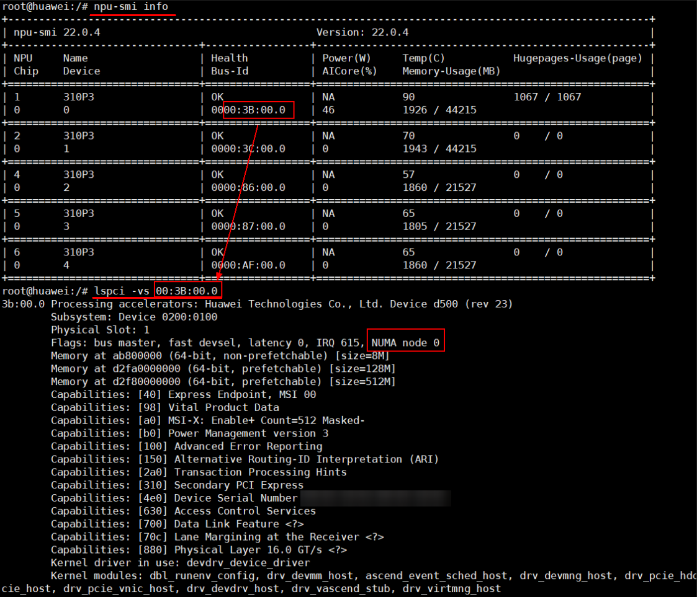

# FAQ

## Common Issues during Upgrade to Faiss 1.10.0

### CMake Error during Faiss 1.10.0 Compilation

**Symptom**

When you compile Faiss 1.10.0, an error message appears with the prompt `CMake 3.24.0 or higher is required`.

**Cause**

The current CMake version is too low. Faiss 1.10.0 requires CMake 3.24.0 or later.

**Solution**

Install CMake 3.24.0 or later. The following example uses CMake 3.24.0:

- x86 environment:
    1. Obtain the CMake installation script.

        ```bash
        wget https://github.com/Kitware/CMake/releases/download/v3.24.0/cmake-3.24.0-linux-x86_64.sh
        ```

    2. Run the installation script.

        ```bash
        bash ./cmake-3.24.0-linux-x86_64.sh --skip-license --prefix=/usr
        ```

        ```bash
        # During installation, you may encounter:
        # Select 1.
        Do you accept the license? [y/n]:
        # Enter y.
        # Select 2.
        By default the CMake will be installed in:
          "/usr/cmake-3.24.0-linux-x86_64"
        Do you want to include the subdirectory cmake-3.24.0-linux-x86_64?
        Saying no will install in: "/usr" [Y/n]:
        # Enter n.
        ```

    3. Check the CMake version.

        ```bash
        cmake --version
        ```

        The current CMake version is shown as follows:

        ```text
        cmake version 3.24.0
        ```

- aarch64 environment:
    1. Obtain the CMake installation script.

        ```bash
        wget https://github.com/Kitware/CMake/releases/download/v3.24.0/cmake-3.24.0-linux-aarch64.sh
        ```

    2. Run the installation script.

        ```bash
        bash ./cmake-3.24.0-linux-aarch64.sh --skip-license --prefix=/usr
        ```

        ```bash
        # During installation, you may encounter:
        # Select 1.
        Do you accept the license? [y/n]:
        # Enter y.
        # Select 2.
        By default the CMake will be installed in:
          "/usr/cmake-3.24.0-linux-aarch64"
        Do you want to include the subdirectory cmake-3.24.0-linux-aarch64?
        Saying no will install in: "/usr" [Y/n]:
        # Enter n.
        ```

    3. Check the CMake version.

        ```bash
        cmake --version
        ```

        The current CMake version is shown as follows:

        ```text
        cmake version 3.24.0
        ```

### Performance Degradation of the Update API After Adding a Large Base Library Using the IVFSQT Algorithm

**Symptom**

After you upgrade from Faiss 1.7.1 to Faiss 1.10.0, the update interface performance of the IVFSQT algorithm degrades after you add a large base library.

**Cause**

After you add a large base library, the update interface of the IVFSQT algorithm uses `IndexFlat` for CPU clustering. In Faiss 1.7.1, `IndexFlat` used the `exhaustive_L2sqr_seq` interface. In Faiss 1.10.0, `exhaustive_L2sqr_seq` adds an `omp num_threads(nt)` constraint, which causes the performance degradation.

**Solution**

Remove the `omp num_threads(nt)` constraint from the `exhaustive_L2sqr_seq` interface in the Faiss source code, then recompile and install Faiss 1.10.0. In multi-card scenarios, you can set `export OMP_NUM_THREADS=2`.

## Generation Operator FAQ

### Prompt: MemoryError or Multiprocessing Error

**Symptom**

An error occurs during generation operator, with a prompt for `MemoryError` or a multiprocessing error.

**Cause**

Insufficient resources during the generation operator process.

**Solution**

When you run the generation operator script, reduce the `-pool` parameter value and rerun the script. You can start by setting `-pool 1`.

### NumPy Data Type np.float_ Has Been Removed

**Symptom**

The following error occurs during generation operator:

Failed to import Python module \[AttributeError: \`np.float\_\` was removed in the NumPy 2.0 release. Use \`np.float64\` instead.\].

**Cause**

Python 3.9 and later versions install NumPy 2.0 by default, but CANN is not currently adapted to NumPy 2.0.

**Solution**

Replace the NumPy version with 1.26.

```bash
pip3 install numpy==1.26
```

### ATC Error during Distance Operator Generation

**Symptom**

When you generate the distance operator, ATC reports the following error:

`Call InferShapeAndType for nodeXXXX failed`

**Cause**

The new version of CANN strengthens validation, and the `InferDataType` implementation is required.

**Solution**

You can set the following environment variable to work around this issue:

```bash
export IGNORE_INFER_ERROR=1
```

### Memory Allocation Failure

**Symptom**

The generation operator fails, and an error message is reported: `.../libgomp.so: cannot allocate memory in static TLS block`.

**Cause**

There is a GCC-related bug in earlier OS versions. For details about this bug, see the official description at [link](https://gcc.gnu.org/bugzilla/show_bug.cgi?id=91938).

**Solution**

Run the following command to set the environment variable.

```bash
export LD_PRELOAD={.../libgomp.so}  # Replace the content in {} with the actual path of the `libgomp.so` file.
```

### Generation Operator Fails on Some OSs

**Symptom**

On some OSs, the generation operator fails with the error: `fatal error: 'cstdint' file not found or fatal error: 'cstdio' file not found`.

**Cause**

Cause 1: For details, see the "Possible Causes" section in the "Error 'fatal error: 'cstdint' file not found' occurs during ATC conversion or model training" chapter of the *CANN Software Installation Guide*.

Cause 2: On some specific systems, this issue stems from differences in the toolchain naming conventions of the OS distribution. When building operators, the Ascend CANN software stack defaults to searching the standard aarch64-linux-gnu toolchain directory for C++ standard library header files. However, on certain specific OSs (kylin, openEuler, ctyunos), the toolchain directory is renamed (for example, to aarch64-kylin-linux) to distinguish specific system ABIs. Because the CANN compiler does not find the corresponding header files in the default path, compilation is interrupted.

**Solution**

You need to manually add the actual C++ header file path of your system to the `CPLUS_INCLUDE_PATH` environment variable to guide the compiler to find the correct files. Taking the Kylin system (GCC 12) as an example, run the following command:

```bash
export CPLUS_INCLUDE_PATH=/usr/include/c++/12/aarch64-kylin-linux:/usr/include/c++/12:$CPLUS_INCLUDE_PATH
```

## Running Inference FAQ

### Segmentation Fault or TBE Error upon Program Exit

**Symptom**

After the search process finishes, an error is reported when the program exits, with prompts such as "segmentation fault" or a TBE error.

**Cause**

This may be because another component in the service process uses ACL resources and calls `aclFinalize` to release them, which causes ACL resources to be released twice.

**Solution**

You can set the environment variable `MX_INDEX_FINALIZE` to `0`, so that Index SDK does not call `aclFinalize`. Setting it to `1` means that `aclFinalize` is still called. Other values are invalid.

You must ensure that `aclFinalize` is called once to release resources when the process exits. Otherwise, errors may still occur upon exit.

### Performance Fluctuation When the Query Count Exceeds 1,000

**Symptom**

When you run a query operation, performance fluctuates if the query count exceeds 1,000.

**Cause**

During concurrent processing on the host CPU, tasks are scheduled to non-affinity CPU cores, which increases latency.

**Solution**

Bind the retrieval application to specific CPU cores. See the following procedure.

1. Obtain the corresponding NUMA node information. As shown in [Figure 1](#fig7992105655611), you can see that the NPU being queried belongs to "NUMA node 0".

    **Figure 1**  Obtaining NUMA node information<a id="fig7992105655611"></a>
    

2. Use `lscpu` to view the CPU core information contained in NUMA node 0. As shown in [Figure 2](#fig1614971412517), you can see that the CPU cores owned by "NUMA node 0" are "0-13,28-41".

    **Figure 2**  Using the command to confirm CPU core information<a id="fig1614971412517"></a>
    

3. Bind the current search application to the confirmed CPU cores. The command reference is as follows.

    ```bash
    taskset -c 0-13,28-41 ./mxIndexApp
    ```

    Where `mxIndexApp` is the search application to bind. Replace it with the actual application name.

## Compilation FAQ

### Prompt: libascendfaiss.so Not Found

**Symptom**

During compilation, the prompt `libascendfaiss.so not found` appears.

**Cause**

The file `libascendfaiss.so` cannot be found through the paths in the environment variables.

**Solution**

Verify the path of `libascendfaiss.so` in the `host/lib` directory of the installation package, and add it to the `LD_LIBRARY_PATH` environment variable.

### An Undefined Reference Error Is Returned When Linking libfaiss.so

On an openEuler 22.03 LTS system, after you compile and install Faiss using the default CMake of the system and `gcc`, an **undefined reference** error is returned when linking `libfaiss.so`.

**Cause**

There is a compatibility issue with the CMake installed by default or installed with the `yum` tool on the openEuler 22.03 LTS system.

**Solution**

Visit the official website of the component to obtain the source code of the corresponding CMake version, then recompile and install it.

## Floating-Point Calculation Precision Issues

### NPU Clustering Results Not Completely Consistent with CPU Clustering Results

During clustering, the distances from some points to two cluster centers are almost equal. Due to a one-in-a-million error in floating-point calculations, the cluster assignment for these vectors becomes uncertain. For details on the Faiss CPU version, see <https://github.com/facebookresearch/faiss/issues/297>. This error is amplified after multiple iterations, so NPU clustering results are not completely consistent with CPU clustering results. When you compare results with the CPU, use CPU clustering consistently.
