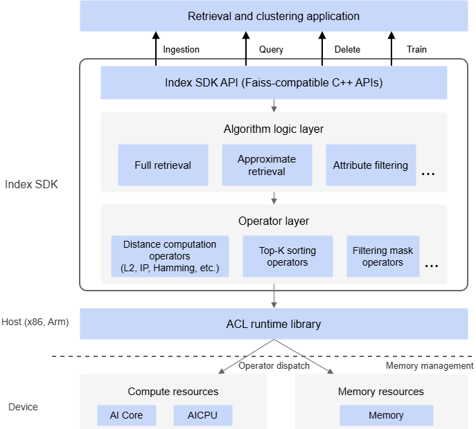

# Introduction

## Index SDK Introduction

**Product Background**

With the development of AI technologies in recent years, advanced algorithm models can effectively extract feature representations from unstructured data such as images, text, and speech. These are structured vector features. In practical scenarios, quickly and accurately finding vectors similar to the query vector has become an important requirement for many intelligent applications. Therefore, you need an efficient retrieval system based on vector features. One of its core components is an efficient retrieval engine.

Against this backdrop, Index SDK on the Huawei Ascend platform implements an efficient vector feature retrieval engine. You can build application-oriented retrieval systems on top of this engine.

**Product Definition**

FeatureRetrieval is a heterogeneous retrieval acceleration framework built on Faiss for Ascend NPUs. It provides high-performance retrieval for large-scale data in high-dimensional spaces. It uses C++ in the Faiss style together with TBE operators and supports the Arm and x86_64 platforms. FeatureRetrieval supports two retrieval library types: <b>small-library search (full retrieval)</b> and <b>large-library search (approximate retrieval)</b>. Small libraries usually contain 300,000 to 1,000,000 records, whereas large libraries can reach tens of millions or even hundreds of millions of records. The supported feature vector dimensions range from 64 to 512 dimensions, depending on the algorithm.

- <b>Small-library search (full retrieval)</b> mainly implements brute-force retrieval algorithms such as Flat, SQ, and INT8. It performs a full search over the feature vectors in the base library and returns the TopK results sorted by distance.
    - The INT8 algorithm performs brute-force retrieval based on feature quantization. Therefore, it is also called "int8flat" (for example, the operator generation script `int8flat_generate_model.py`).
    - The SQ algorithm uses internal quantization. Because it uses 8-bit integers for quantization, it is also called "SQ8" (for example, `sq8_generate_model.py`).

- <b>Large-library search (approximate retrieval)</b> implements the IVFSQ algorithm on the Ascend platform based on the Faiss feature retrieval framework and the IVF approach. Here, IVF differs from the traditional inverted index. Its basic idea is to cluster features first and then narrow the retrieval range through the cluster centers. This method trades accuracy for performance.

The underlying implementation of each algorithm uses TBE operators accelerated on the Ascend platform.

In addition, FeatureRetrieval supports attribute-filtered retrieval and batch retrieval across multiple indexes.

- **Attribute-filtered retrieval** lets you add time- and spatial-related attributes during base-library vector ingestion and then retrieve using base-library data under specific time and spatial conditions.
- **Batch retrieval across multiple indexes** lets you use multiple indexes to split libraries and retrieve multiple base libraries at once through a unified interface.

**Product Value**

As a high-performance vector retrieval SDK, Index SDK offers the following benefits:

- Compatibility with mainstream frameworks: native Faiss APIs, ready to use.
- High performance: on the same compute card, full retrieval outperforms the industry standard, and batch retrieval outperforms serial scenarios.
- Large memory capacity: supports vector retrieval on a single card with a base library containing hundreds of millions of records.

## Software Architecture

The software architecture of Index SDK is shown in [Figure 1, software architecture](#fig883164172512), and the key modules in the architecture are described in [Table 1, Index SDK module introduction](#table3548152713258).

**Figure 1** Software architecture

**Table 1** Index SDK module introduction

|Module|Description|
|--|--|
|Index SDK API layer|Provides Faiss-compatible C++ interfaces. Upper-layer applications can implement feature ingestion, query, deletion, and training functions.|
|Algorithm logic layer|Implements the logical flow of retrieval algorithms. The currently supported algorithms mainly include brute-force retrieval, approximate retrieval, and attribute-filtering algorithms.|
|Operator layer|Provides acceleration operators for retrieval algorithms on the Ascend platform, including distance computation operators, TopK sorting operators, and attribute-filtering mask operators.|

## Getting Started

**Usage Process**

As shown in [Figure 1 Index SDK usage process](#fig15421350143413), using Index SDK for feature retrieval can be divided into the following steps.

**Figure 1** Index SDK usage process

1. Deployment.
    1. Learn about the supported hardware form factors and OSs for Index SDK. See "[Supported hardware and OSs](#supported-hardware-and-oss)".
    2. Learn how to install the required dependencies. See "[Install dependencies](./installation_guide.md#dependency-installation)".
    3. Obtain and verify the Index SDK software package. See "[Obtain the Index SDK software package](./installation_guide.md#index-sdk-package-download)".
    4. Learn how to install and deploy Index SDK. See "[Install Index SDK](./installation_guide.md#index-sdk-installation)".

2. Determine the retrieval type and algorithm.

    Learn about the retrieval types supported by Index SDK and the algorithms included in each retrieval type, including the use cases for each algorithm, the operators that need to be generated, and the sample descriptions. Analyze your actual service requirements and determine the retrieval type and algorithm you need to use. See "[Algorithm introduction](./user_guide.md#algorithm-introduction)".

3. Generate operators.

    Generate the operators required by the algorithm. See "[Generate operators](./user_guide.md#generating-operators)".

4. Call the API to implement the algorithm and obtain the retrieval results. See "[API reference](./api/README.md)".

**Usage Notes**

- The current Index SDK FeatureRetrieval is developed and adapted based on Ascend AI Processors and the open-source Faiss similarity search framework. Compatibility with any other hardware or heterogeneous computing platform is outside the scope of this document and the product.
- The deployment method for FeatureRetrieval is implemented through AscendCL interfaces. Therefore, `aclInit` has already been called internally, and you do not need to call it again.
- The maximum capacity supported by a single Index (base library) depends on the device-side memory size of the specific Ascend AI Processor. The service side needs to plan the number of indexes according to actual requirements to prevent memory overruns. You are advised to create fewer than 10,000 indexes. After you exceed 10,000, the resulting memory fragmentation is significant and may cause the capacity of the `add` operation to be smaller than expected.

## Supported Hardware and OSs

<table>
<tr>
<th>Product Series</th>
<th>Product Model</th>
<th>OSs (64-bit Only)</th>
</tr>
<tr>
<td rowspan="5">Atlas inference products</td>
<td>Atlas 300I Pro inference card</td>
<td><li>CentOS 7.6</li><li>openEuler 20.03</li><li>
openEuler 22.03</li><li>openEuler 24.03</li><li>Ubuntu 18.04</li><li>Ubuntu 20.04</li><li>EulerOS 2.12</li><li>EulerOS 2.15</li><li>KylinOS V10 SP3 2403</li><li>KylinOS V11</li><li>CTyunOS 23.01</li><li>UOS V20</li></td>
</tr>
<tr>
<td>Atlas 300V video analysis card</td>
<td><li>CentOS 7.6</li><li>openEuler 20.03</li><li>openEuler 22.03</li><li>Ubuntu 18.04</li><li>Ubuntu 20.04</li><li>EulerOS 2.12</li><li>UOS V20</li></td>
</tr>
<tr>
<td>Atlas 300V Pro video analysis card</td>
<td><li>CentOS 7.6</li><li>openEuler 20.03</li><li>openEuler 22.03</li><li>openEuler 24.03</li><li>Ubuntu 18.04</li><li>Ubuntu 20.04</li><li>EulerOS 2.12</li><li>CTyunOS 23.01</li><li>UOS V20</li></td>
</tr>
<tr>
<td>Atlas 300I Duo inference card</td>
<td><li>CentOS 7.6</li><li>Ubuntu 18.04</li><li>Ubuntu 20.04</li><li>EulerOS 2.12</li><li>EulerOS 2.15</li><li>KylinOS V10 SP3 2403</li><li>KylinOS V11</li><li>openEuler 24.03</li><li>CTyunOS 23.01</li><li>UOS V20</li><li>UOS V25</li></td>
</tr>
<tr>
<td>Atlas 200I SoC A1 core board</td>
<td><li>CentOS 7.6</li><li>openEuler 20.03</li><li>EulerOS 2.12</li></td>
</tr>
<tr>
<td rowspan="2">Atlas 200/300/500 inference products</td>
<td>Atlas 300I inference card (Model 3000)</td>
<td><li>CentOS 7.6</li><li>openEuler 20.03</li><li>openEuler 22.03</li><li>Ubuntu 18.04</li><li>Ubuntu 20.04</li><li>EulerOS 2.12</li><li>UOS V20</li></td>
</tr>
<tr>
<td>Atlas 300I inference card (Model 3010)</td>
<td><li>CentOS 7.6</li><li>openEuler 20.03</li><li>openEuler 22.03</li><li>Ubuntu 18.04</li><li>Ubuntu 20.04</li><li>EulerOS 2.12</li><li>UOS V20</li></td>
</tr>
<tr>
<td ><term>Atlas A2 inference products</term>
 Note: Atlas A2 inference products support the AscendIndexFlat and AscendIndexInt8Flat algorithms.</td>
<td>Atlas 800I A2 inference server</td>
<td><li>CentOS 7.6</li><li>openEuler 20.03</li><li>openEuler 22.03</li><li>openEuler 24.03</li><li>Ubuntu 18.04</li><li>Ubuntu 20.04</li><li>Ubuntu 24.04</li><li>EulerOS 2.12</li><li>EulerOS 2.15</li><li>UOS V20</li><li>UOS V25</li><li>KylinOS V10 SP3</li><li>KylinOS V11</li><li>BC-Linux_21.10 U4</li></td>
</tr>
<tr>
<td><term>Atlas A3 inference products</term> Note: Currently, only the AscendIndexFlat algorithm is supported.</td>
<td>Atlas 800I A3 SuperNode server</td>
<td><li>Ubuntu 18.04</li><li>CUlinux 3.0</li><li>KylinOS V10 SP3 2403</li><li>KylinOS V11</li><li>CTyunOS 4</li><li>UOS V25</li></td>
</tr>
</table>
