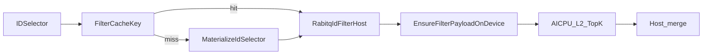

# IVF-RabitQ支持IDSelector过滤检索技术方案设计(RFC)

**状态 (Status):** Draft
**作者 (Authors):** @duliqiang
**创建日期 (Created):** 2026-08-24
**更新日期 (Updated):** 2026-08-27
**相关 Issue/PR:** [#127](https://gitcode.com/Ascend/IndexSDK/issues/127)、[!390](https://gitcode.com/Ascend/IndexSDK/merge_requests/390)、[!391](https://gitcode.com/Ascend/IndexSDK/merge_requests/391)、[!392](https://gitcode.com/Ascend/IndexSDK/merge_requests/392)、[!409](https://gitcode.com/Ascend/IndexSDK/merge_requests/409)、[!411](https://gitcode.com/Ascend/IndexSDK/merge_requests/411)
**性能增量:** `334b5c7`（`!409`：稠密 Batch/Array 转 bitmap + Host/Device 缓存 + 单次 `nprobe`）、`e296b74`（`!411`：Array/Bitmap cache hit 不再算全量 payload hash）

---

# 1. 概述

## 1.1 简介

本提案在既有 **AscendIndexIVFRaBitQ** 检索能力之上，对齐 FAISS 的 `SearchParameters.sel`（`IDSelector`）语义，支持在检索阶段按向量 ID 过滤结果。

IVF-RabitQ 主体算法（训练、入库、L1/L2、LUT、Refine 等）见主 RFC：
[IVF-RabitQ检索算法技术方案设计(RFC).md](./IVF-RabitQ检索算法技术方案设计(RFC).md)。本文仅描述 **ID 过滤检索** 这一增量能力，以及相对 `!392` 合入基线的物化、缓存与单次 `nprobe`。

本文记录 **as-implemented** 方案：能力底座已合入 `tech_v26.2.0`（`!390` / `!391` / `!392`），查询期缓存、稠密选择器物化与单次 `SearchParametersIVF.nprobe` 已由 `!409` / `!411` 落地。公开接口仍是 `search(..., const SearchParameters *params)`：基类只消费 `params->sel`；传入 `SearchParametersIVF` 时额外消费本次 `nprobe`。

### 核心特性

- **接口兼容**：复用 FAISS `search(..., const SearchParameters *params)`，通过 `params->sel` 传入过滤器；`params == nullptr` 或 `sel == nullptr` 时不过滤，行为与改造前一致。
- **Late-filter**：在 AICPU L2 TopK 入堆前做 membership 判断，不改 AscendC L2 算子、不增加持久化底库 mask。
- **多卡一致**：Host 侧一次物化全局 ID 过滤器，各卡对本地候选应用同一 selector，再在 Host 合并 top-k。
- **查询期缓存**：Host 单槽复用物化结果，Device 复用 payload 跳过重复 H2D；命中路径与无过滤检索对齐。
- **单次 nprobe**：传入 `SearchParametersIVF` 时，`nprobe` 仅对本次查询生效（须 `> 0` 且 `<= nlist`），不改 index 上的 `nprobe`。

## 1.2 动机

### 背景

FAISS 生态广泛使用 `IDSelector` 在检索时限定候选 ID（白名单 / 黑名单 / 区间）。业务侧常见需求包括：仅检索某一用户子集、排除已曝光 ID、按 ID 区间分片查询等。

### 痛点

- 改造前 `AscendIndexIVFRaBitQ::search` 未消费 `params->sel`，无法与 FAISS CPU 过滤检索对齐。
- 若依赖 `remove_ids` 永久删库，无法满足「单次查询临时过滤」场景。
- TS 路径的 AttrFilter 面向属性表达式，与「按向量 ID 过滤」语义不同，无法直接复用。
- `!392` 合入后能力已齐，但每次 `search` 都在 Host 物化 `IDSelector` 并每次 H2D：稠密 Array/Batch 走排序列表 + 二分查找，相对无过滤可慢 2–4 倍；亿级底库上物化与拷贝税远大于 late-filter 本身。

### 价值

- 与 FAISS 过滤检索语义对齐，降低业务迁移成本。
- 过滤为查询期临时物化，不污染底库、不增加常驻 HBM 占用（Device 仅缓存最近一次 payload）。
- 与现有 L1/L2/Refine 管线解耦，改动面可控。
- 复用同一选择器或同一 Array/Bitmap buffer 时，过滤检索与无过滤同档。

## 1.3 目标

### 目标

- 支持通过 `SearchParameters.sel` 传入：
  - `IDSelectorRange` / `IDSelectorBatch` / `IDSelectorArray` / `IDSelectorBitmap`
  - 以及上述类型的 **单层** `IDSelectorNot`
- 传入 `SearchParametersIVF` 时，本次 `nprobe` 覆盖 index 上的 `nprobe`（不写回 index）。
- 多卡场景下同一全局 ID selector 应用于每张卡，Host 合并结果。
- 保持无过滤检索路径兼容；精度与 CPU 过滤检索基线可对齐（见 UT）。
- 稠密 keep 集优先物化为 bitmap；Host/Device 缓存命中时跳过重复物化与 H2D。

### 非目标

- 不修改 AscendC L2 距离算子实现。
- 不做底库侧持久化 filter mask / list prune。
- 不支持 `IDSelectorAnd` / `IDSelectorOr` 等复合选择器，以及嵌套多层 `IDSelectorNot`。

### 平台支持

- 与现有 IVF-RabitQ 一致（依赖已部署的 AICPU TopK / L2 相关算子）。

---

# 2. 用例分析

## 2.1 功能需求

| 场景 | 输入 | 期望行为 |
|------|------|----------|
| 无过滤 | `params == nullptr` 或 `sel == nullptr` | 与改造前 search 一致 |
| Range | `IDSelectorRange(imin, imax)` | 仅返回 `[imin, imax)` 内 ID |
| Batch | `IDSelectorBatch` | 仅返回集合内 ID |
| Array | `IDSelectorArray` | 仅返回数组内 ID |
| Bitmap | `IDSelectorBitmap` | 按位图置位 ID 返回；FAISS `n` 为 bitmap **字节长度**（合法 ID ∈ `[0, n*8)`） |
| Not | `IDSelectorNot` 包裹上述之一 | 对 membership 取反 |
| 单次 nprobe | `SearchParametersIVF` 且 `nprobe > 0` | 本次 L1 probe 数用该值；不改 `index.getNumProbes()` |
| 多卡 | 设备列表 ≥ 2 | 各卡同一 selector，Host merge top-k |
| 不足 k | 过滤后候选不足 | 结果以 `-1` 填充（与 FAISS 习惯一致） |
| Array/Bitmap wrap | 同一 buffer 上新建包装器 | payload 键命中，不重新物化、不重复 H2D |
| Range/Batch wrap | 新对象、内容相同 | 对象键 miss，重新物化（Range 极轻；Batch 需扫 hash set） |

## 2.2 约束说明

- **Late-filter**：L2 距离仍对 probed lists 内候选全量计算；membership 检查相对廉价。高过滤比场景下算力仍可能被浪费。
- **Bitmap**：对齐 FAISS `IDSelectorBitmap`：`n` 为 bitmap **字节数**（`is_member` 以 `(id >> 3) >= n` 判界，等价合法 ID 范围 `[0, n*8)`）；Host 物化时只挂用户 buffer（零拷贝），`aux0 = n * 8` 作为 bit 容量上限供 Device 侧边界检查。
- **物化形态**：Array / Batch 在 `PreferBitmap` 为真时转为 `BITMAP`（bitmap ≤ 128 MB 且不大于排序列表体积）；否则回退 `SORTED`。负 id 不走 bitmap 快路径。
- **ntotal 单遍**：Array / Batch 优先按索引 `ntotal` 分配一张 bitmap 并单遍填 bit；出现 `id < 0` 或 `id >= ntotal` 时清空后回退两遍扫描（先找 maxId）。
- **Host 缓存**：单槽、mutex 保护。Array / Bitmap（及外包一层 `IDSelectorNot`）按 `(payload 指针, n, negate)` 命中；Range / Batch 按选择器对象指针命中。`add` / `delete` 调用 `InvalidateFilterCache()`。
- **Device 缓存**：`src`、`payloadBytes`、`mode`、`negate`、`aux0`、`aux1`、`generation` 全部一致时跳过 H2D；`reset()` / `addVectors` / `removeIds` 调用 `ClearCachedFilterPayload()`。
- **生命周期**：`IDSelector` 以及 Array / Bitmap 引用的 ids、bitmap 须在 `search` 返回前保持有效；缓存期内不要原地修改这些 buffer（键只比指针和长度，不比内容）。
- **nprobe**：传入 `SearchParametersIVF` 时读取 `nprobe`（须 `> 0`，且 `<= numeric_limits<int>::max()`，且 `<= nlist`），仅本次查询作为 L1 `probeK`；基类 `SearchParameters` 只过滤时仍用 index 上的 `nprobe`。FAISS `SearchParametersIVF.nprobe` 默认值为 **1**，只过滤请继续用基类，或显式设成 `index.getNumProbes()`。`int` 上界是因为 `searchNprobe` 以 `int` 下传；正常 `nlist` 远小于该值，超大输入会先报 `"exceeds int range"`。
- **不支持类型**：抛出明确错误：
  `AscendIndexIVFRaBitQ search IDSelector only supports Range/Batch/Array/Bitmap and IDSelectorNot of them`

## 2.3 验收

| 类型 | 位置 | 覆盖点 |
|------|------|--------|
| UT | `feature_retrieval/src/ascendfaiss/ut/TestAscendIndexUTIVFRabitQ.cpp` | `SearchWithIdSelector`：Range / Batch / Bitmap / Not；`SearchWithIdSelectorSharedPayload`：同一 Array/Bitmap buffer 上两个包装器及 Not 共享 inner；`SearchWithIdSelectorMultiDevice`：多卡（设备数不足时 skip）；`SearchParametersIVFNprobe` / `SearchParametersIVFInvalidNprobe`：单次 nprobe 与非法值 |
| API 文档 | `docs/zh/api/02_approximate_retrieval.md`（IVFRaBitQ §search） | 接口、支持类型、缓存与 buffer 生命周期约束、单次 nprobe |
| 性能摸底 | 本文 §3.5 | 相对 `!392` 的 hit / wrap / content 对照；口径参数与数字见 §3.5；不作为功能合入门槛。摸底脚本与独立报告未随本 RFC 合入 |

---

# 3. 方案设计

## 3.1 技术选型

可选路径对比：

| 方案 | 做法 | 优点 | 缺点 | 结论 |
|------|------|------|------|------|
| A. AscendC L2 内过滤 | 距离算子侧跳过非成员 | 可省部分算力 | 改动算子面大、回归成本高 | 不采用 |
| B. 底库持久 mask | 建库/更新时维护可检索集合 | 高过滤比友好 | 语义变成「改库」；内存与一致性成本高 | 不采用 |
| **C. AICPU TopK late-filter** | L2 完成后、入堆前判断 ID | 与现有 L1/L2 解耦；实现快；对齐 FAISS 临时过滤 | 高过滤比仍算满 L2 | **采用** |

相对 `4a36968`（`!392`）的增量是物化策略、Host/Device 缓存与单次 nprobe，**不改变过滤时机**：仍是 AICPU TopK late-filter。

## 3.2 总体数据流



说明：

1. Host 将 FAISS `IDSelector` 按缓存键查找；miss 时物化为设备无关结构 `RabitqIdFilterHost`。
2. 每张卡走既有 L1（本次 `nprobe` 或 index `nprobe`）→ L2；Device 侧按 payload 源指针、元数据与 `generation` 决定是否 H2D，再把 filter attrs 写入 TopK。
3. AICPU TopK 在更新堆前调用 `IsIdSelected(candId)`；未选中则跳过。
4. 多卡结果在 Host 按距离合并为最终 top-k。
5. 若开启 Refine，精排作用于 **已过滤** 的 L2 候选。

## 3.3 能力底座（!390 / !391 / !392）

### 3.3.1 对外接口

```cpp
void search(idx_t n, const float *x, idx_t k,
            float *distances, idx_t *labels,
            const SearchParameters *params = nullptr) const override;
```

- 消费 `params->sel`。
- 若 `dynamic_cast<const SearchParametersIVF*>(params)` 成功，再校验并消费本次 `nprobe`（须 `> 0`，且 `<= numeric_limits<int>::max()`，且 `<= nlist`），经 `searchWithSelector(..., searchNprobe)` 传到 L1 `probeK`；`searchNprobe == 0` 时 Daemon 回退 index `nprobe`。`int` 上界为防御性校验（`searchNprobe` 以 `int` 传递）；超大值先抛 `"SearchParametersIVF.nprobe exceeds int range"`。
- 实现入口：`AscendIndexIVFRaBitQ` → `AscendIndexIVFRaBitQImpl::searchWithSelector`。

### 3.3.2 Host 物化：`RabitqIdFilterHost`

定义于 `feature_retrieval/src/ascendfaiss/common/RabitqIdFilter.h`：

| 字段 | 含义 |
|------|------|
| `mode` | `NONE / RANGE / SORTED / BITMAP` |
| `negate` | 非 0 表示对 membership 取反（来自 `IDSelectorNot`） |
| `aux0` / `aux1` | RANGE: `[imin, imax)`；SORTED: 有序数组长度；BITMAP: bit 容量（FAISS `n` 为字节数，故 `aux0 = n * 8`） |
| `sortedIds` / `bitmap` | 自有 payload（Array/Batch 物化结果） |
| `bitmapView` / `viewBytes` | Bitmap 零拷贝：挂用户 buffer；H2D 打该指针 |
| `sortedView` | 预留字段，当前物化路径始终置空；Array/Batch 走自有 `sortedIds` 或 bitmap |
| `generation` | Host 重新物化或 `InvalidateFilterCache` 时递增；Device 缓存键的一部分 |
| `payloadSrc()` / `payloadBytes()` | Device 侧拷贝源与字节数；RANGE 为 0 |

`!392` 基线映射（后续 3.4 节改写了 Array/Batch/Bitmap 的物化细节，AICPU 语义不变）：

| FAISS 类型 | mode | `!392` 物化要点 |
|------------|------|-----------------|
| `IDSelectorRange` | `RANGE` | `aux0=imin`, `aux1=imax` |
| `IDSelectorBatch` | `SORTED` | set → `sortedIds` 排序，`aux0=size` |
| `IDSelectorArray` | `SORTED` | 排序 + unique，`aux0=size` |
| `IDSelectorBitmap` | `BITMAP` | 拷贝 FAISS `n` 字节；`aux0 = n * 8` |
| `IDSelectorNot(上述)` | 同上 | `negate=1`（仅剥一层） |

### 3.3.3 Daemon 与 AICPU attrs

`kernel_shared_def.h` 中扩展：

```text
TOPK_IVF_RABITQ_ATTR_SEL_MODE_IDX
TOPK_IVF_RABITQ_ATTR_SEL_PTR_IDX
TOPK_IVF_RABITQ_ATTR_SEL_AUX0_IDX
TOPK_IVF_RABITQ_ATTR_SEL_AUX1_IDX
TOPK_IVF_RABITQ_ATTR_SEL_NEGATE_IDX
```

`RabitqIdFilterMode`：

| 枚举 | 值 | 语义 |
|------|----|------|
| `RABITQ_ID_FILTER_NONE` | 0 | 不过滤 |
| `RABITQ_ID_FILTER_RANGE` | 1 | `[aux0, aux1)` |
| `RABITQ_ID_FILTER_SORTED` | 2 | `ptr → int64[aux0]`，二分查找 |
| `RABITQ_ID_FILTER_BITMAP` | 3 | `ptr → uint8[]`，按 bit；`aux0` 为 bit 容量（8 的倍数） |

`IndexIVFRaBitQ::searchImplL2`：若存在 filter，将 payload 放到 Device 并把 attrs 写入 TopK；`mode==NONE` 时 attrs 为零语义，与旧路径兼容。

### 3.3.4 TopK late-filter

`TopkIvfRabitqfP32CpuKernel::IsIdSelected`：

1. `NONE` → 恒 true
2. `RANGE` → `id ∈ [aux0, aux1)`
3. `SORTED` → `binary_search`
4. `BITMAP` → `0 ≤ id < aux0` 且 `bitmap[id >> 3]` 对应 bit 为 1
5. 若 `negate != 0` → 对结果取反

非法 `selMode`、`negate` 非 0/1、SORTED/BITMAP 的 ptr/aux 不合法时，AICPU 在 attr 校验阶段报错。未选中的候选不进入 top-k。

### 3.3.5 多卡与 Refine

- **多卡**：`searchImplFiltered` 对各 device 传入同一 `RabitqIdFilterHost*`；membership 按 **全局 ID** 语义；最终 `mergeSearchResult` 与无过滤路径一致。
- **Refine**：L2 TopK 已带 filter，Refine 输入为过滤后的候选，无需二次 ID 过滤逻辑。

## 3.4 物化与缓存（`334b5c7` / `!409` + `e296b74` / `!411`）

`!392` 上每次 `search` 都在栈上构造 `RabitqIdFilterHost` 并走 `MaterializeIdSelector`，Device 每次分配临时 tensor 再 `aclrtMemcpy` H2D。稠密 Array/Batch 永远 sort 成 SORTED，候选侧二分查找。`!409` 不改过滤公开接口，改物化形态与缓存，并让 `SearchParametersIVF.nprobe` 单次生效；`!411` 去掉 Array/Bitmap cache hit 路径对 ids/bitmap 内容的全量 hash。

### 3.4.1 `PreferBitmap`

```text
bitmapBytes = maxId / 8 + 1
sortedBytes = nIds * sizeof(int64_t)
PreferBitmap ⇔ 无负 id 且 maxId >= 0 且 nIds > 0
              且 bitmapBytes <= 128MB
              且 bitmapBytes <= sortedBytes
```

128 MB 上界覆盖约 1.07e9 个 ID。失败时回退 SORTED，行为接近 `!392` 基线。

### 3.4.2 Array / Batch：按 ntotal 单遍填 bitmap

`MaterializeFromIds` / `MaterializeFromIdSet`：

1. `TryMaterializeBitmapByNtotal`：按索引 `ntotal` 分配一张 bitmap（`PreferBitmap(ntotal-1, nIds)` 为真时）。
2. 单线程 `FillBitmapChecked`（Array）或 `FillBitmapCheckedFromSet`（Batch）。
3. 若出现 `id < 0` 或 `id >= ntotal`：`resetKeepCapacity()` 后回退两遍——先扫 maxId，再按真实上界填 bitmap 或 sort。

`resetKeepCapacity()` 清空逻辑字段但保留 vector 容量与 `generation`，miss 路径反复物化时少做堆分配。

摸底规模（`ntotal=1e8`、keep 一半）下 bitmap 12.5 MB、排序列表 400 MB，稳定走单遍 bitmap。

### 3.4.3 Bitmap 零拷贝

物化 `IDSelectorBitmap` 时只挂 `bitmapSel->bitmap` 到 `bitmapView`，不再 `assign` 到 Host vector。H2D 打用户 buffer。因此：

- wrap（同一 buffer、新包装器）不再付 Host 拷贝；
- content（内容相同、地址不同）只剩一次 bitmap H2D。

`sortedView` 当前未使用。

### 3.4.4 Host 单槽 payload 缓存

`searchWithSelector` 取 `getCachedFilter(sel)`，单槽、`filterCacheMutex` 保护。

`FilterCacheKey`（`AscendIndexIVFRaBitQImpl.h`）：

| 选择器 | kind | 命中条件 |
|--------|------|----------|
| `IDSelectorArray`（含外包一层 Not） | Array | `(payload 指针, n, negate)`；`contentHash` 恒为 0 |
| `IDSelectorBitmap`（含外包一层 Not） | Bitmap | `(payload 指针, n, negate)`；`contentHash` 恒为 0 |
| Range | Object | 选择器对象指针 + negate；`contentHash = imin`，`n = imax` |
| Batch / 其他 | Object | 选择器对象指针 + negate |

`FilterCacheKey::contentHash` 字段仍保留，并参与 `IsFilterCacheHit` 比较。`!411` 去掉的是 Array/Bitmap 对 ids/bitmap **内容** 的全量 hash，不是删除该字段：Array/Bitmap 不再把 payload 指纹写入 `contentHash`（保持 0）；Range 仍用它存 `imin`，同对象原地改区间会 miss。

同一 keep buffer 上每次 `new` Array/Bitmap 包装器不会重新物化。Range / Batch 新对象即 miss。

`addImpl` / `deleteImpl` 调用 `InvalidateFilterCache()`：清空单槽并递增 `generation`，避免底库变更后仍命中旧物化结果。

### 3.4.5 Device payload 缓存

`IndexIVFRaBitQ` 用常驻 `DeviceVector<uint8_t>` 替代每次 search 的临时 tensor。`EnsureFilterPayloadOnDevice` 在下列全部一致时复用 device 指针：

`src`、`payloadBytes`、`mode`、`negate`、`aux0`、`aux1`、`generation`

`generation` 防止 Host 对同一 `src` 重新物化后 Device 仍复用旧 payload。Range 的 `payloadBytes()==0`，不走 H2D。`reset()`、`addVectors`、`removeIds` 调用 `ClearCachedFilterPayload()`。

Host 命中且 payload 源指针与 `generation` 未变时，Device 也命中，整条路径只剩 AICPU TopK。

### 3.4.6 当前物化映射

| FAISS 类型 | 当前 mode | 物化要点 |
|------------|-----------|----------|
| `IDSelectorRange` | `RANGE` | 只写 `imin` / `imax`，无 payload |
| `IDSelectorBatch` | 优先 `BITMAP`，否则 `SORTED` | 按 ntotal 单遍填 bitmap；越界或 `PreferBitmap` 失败则两遍 / sort |
| `IDSelectorArray` | 优先 `BITMAP`，否则 `SORTED` | 同上 |
| `IDSelectorBitmap` | `BITMAP` | 零拷贝挂用户 buffer；`aux0 = n * 8` |
| `IDSelectorNot(上述)` | 同上 | `negate=1`（仅剥一层） |

## 3.5 性能结论

口径（自包含，摸底脚本与独立报告未随本 RFC 合入）：`ntotal=1e8`、dim/nlist/nprobe/k = 128/1024/32/10、keep_ratio=0.5、warmup/loop = 10/100。

三种请求形态：

- **hit**：同一 `IDSelector*` 连续检索
- **wrap**：两个包装器乒乓，底层 keep buffer 相同（Array/Bitmap 测 payload 键；Range/Batch 测对象键）
- **content**：两份内容相同、地址不同的 buffer（仅 Array / Bitmap 及其 Not）

### 3.5.1 `!392` 基线瓶颈

当时每次调用都物化、每次 H2D。Array 是 400 MB 级拷贝 + 排序；Batch 还要先把 hash set 扫成 vector；Bitmap 再拷 12.5 MB。late-filter 计算本身几乎看不见。

### 3.5.2 当前树（nq=32）

| 请求形态 | 额外时延（相对同选择器 hit） | 含义 |
|----------|------------------------------|------|
| 任意选择器 **hit** | ≈ 0 | 与 `none` 同档；约 **779 QPS / 41 ms** |
| Range **wrap** | ≈ 0 | 无 payload；对象不同但物化极轻 |
| Array / Bitmap **wrap** | ≈ 0 | payload 键命中，不物化、不 H2D |
| Bitmap **content** | **+0.6–1.2 ms** | 新 buffer → 12.5 MB H2D |
| Array **content** | **+112–116 ms** | 新 ids 指针 → 50M 次写 bit |
| Batch **wrap** | **+216–229 ms** | 新 Batch 对象 → 扫 hash set 填 bitmap |
| `not_*` **hit** | nq=32 约 2–4% | negate 检查，不是缓存 miss |

物化 extra 几乎与 nq 无关（Host 填 bitmap / 扫 hash set）；QPS 比值随 nq 下降是因为分母里的 L2 TopK 变长。

### 3.5.3 应用最佳实践

按收益从大到小：

1. **能复用就复用同一个 `IDSelector` 对象。** hit 路径已与无过滤对齐。
2. **过滤集是稳定 keep 集合时，优先 `IDSelectorBitmap`。** wrap ≈ 1.00x；即使每次换一份拷贝，也只有约 1 ms 级 H2D（本摸底规模）。
3. **必须用 Array 时，复用 `ids` buffer。** 同一指针上换包装器走 payload 缓存；每次 `new` 一块 50M ids 会固定付约 +112 ms。
4. **不要每请求 `new IDSelectorBatch(千万 ids)`。** Batch 按对象指针缓存，新对象必 miss，本规模约 +220 ms，且构造时还要自己建 `unordered_set`。
5. **`IDSelector` 以及 Array/Bitmap 引用的 buffer，必须在 `search` 返回前保持有效。**
6. **缓存期内不要原地改 ids / bitmap。** 要换过滤集：换 buffer，或先换一个不同的选择器把单槽冲掉。
7. **自定义 id 请落在 `[0, ntotal)`。** 越界会放弃 ntotal 单遍。
8. **Range 已经足够便宜**，无需为性能再包一层 Array/Batch。
9. **只过滤时用基类 `SearchParameters`。** 传入 `SearchParametersIVF` 且不设 `nprobe` 时 FAISS 默认为 1。

```cpp
// 推荐：Bitmap 建一次，后续 search 只换 query
faiss::IDSelectorBitmap sel(bitmap.size(), bitmap.data());
faiss::SearchParameters params;
params.sel = &sel;
index.search(nq, x, k, dist, labels, &params);

// 推荐：Array 复用同一 ids 指针（包装器可每次栈上构造）
faiss::IDSelectorArray sel(nKeep, keepIds.data());

// 本次覆盖 nprobe，不改 index.getNumProbes()
faiss::SearchParametersIVF ivfParams;
ivfParams.nprobe = 32;
ivfParams.sel = &sel;

// 不推荐：每个请求 IDSelectorBatch(5e7, ...)
```

## 3.6 文件映射与合入切片

| 层级 | 路径 | 职责 |
|------|------|------|
| Host API | `ascend/AscendIndexIVFRaBitQ.{h,cpp}` | 读取 `params->sel` 与 `SearchParametersIVF.nprobe`，转发 Impl |
| Host Impl | `ascend/impl/AscendIndexIVFRaBitQImpl.{h,cpp}` | 物化 selector；Host 缓存；多卡透传；`searchWithSelector` |
| 公共结构 | `common/RabitqIdFilter.h` | `RabitqIdFilterHost`、Bitmap 零拷贝视图、`generation`、`payloadSrc` / `payloadBytes` |
| Daemon | `ascenddaemon/impl/IndexIVFRaBitQ.{h,cpp}` | Device payload 缓存；填充 TopK attrs；本次 nprobe |
| 共享定义 | `ops/cpukernel/impl/utils/kernel_shared_def.h` | mode / attr 下标 |
| AICPU | `ops/cpukernel/impl/topk_ivf_rabitq_fp32_cpu_kernel.{h,cpp}` | `IsIdSelected` late-filter |
| UT | `ut/TestAscendIndexUTIVFRabitQ.cpp` | 功能、共享 payload 缓存语义、多卡、单次 nprobe |
| 用户 API 文档 | `docs/zh/api/02_approximate_retrieval.md` | IVFRaBitQ search 说明 |

合入切片（目标分支 `tech_v26.2.0`，关联 #127）：

1. **!390**：`RabitqIdFilter.h`、`kernel_shared_def.h`、AICPU TopK late-filter 与 attr 校验
2. **!391**：Host / Daemon 接线，`SearchParameters.sel` 物化并透传到 TopK attrs
3. **!392**：UT + 中文 API 资料
4. **!409**（`334b5c7`）：稠密 Batch/Array 转 bitmap；Host/Device payload 缓存；Bitmap 零拷贝；按 ntotal 单遍填 bitmap；`SearchParametersIVF.nprobe` 单次生效；`SearchWithIdSelectorSharedPayload`
5. **!411**（`e296b74`）：Array/Bitmap cache hit 不再算全量 payload hash（`contentHash` 字段仍保留；Range 用其存 `imin`）

---

# 4. 缺点和风险

| 风险 | 说明 | 缓解 |
|------|------|------|
| 高过滤比 QPS 下降 | Late-filter 仍算满 probed lists 的 L2 | 文档明示；后续若需要可评估 list 侧 prune |
| 复合 selector 不支持 | And/Or/多层 Not 会抛错 | 错误信息明确；可按业务再扩展物化层 |
| 单槽缓存抖动 | 一个 index 只记住最近一次过滤；交替两套完全不同的 keep 集会来回 miss | 文档说明；稳定过滤集应复用对象或 buffer |
| Batch 无 payload 键 | 逻辑相同的两个 `IDSelectorBatch` 仍是两次物化 | 稳定过滤集改 Bitmap/Array，或留住同一个 Batch 对象 |
| 键不比内容 | 原地改 ids/bitmap 仍会命中旧物化结果 | API 约束：缓存期内不要原地改；换过滤集则换 buffer |
| 越界 id 回退两遍 | 负 id 或 `id >= ntotal` 放弃 ntotal 单遍 | 文档要求自定义 id 落在 `[0, ntotal)` |
| `PreferBitmap` 失败 | bitmap > 128 MB，或比排序列表更大 | 回退 SORTED，行为接近 `!392` |
| `SearchParametersIVF.nprobe` 默认 1 | 只过滤却传入 IVF 派生参数时，会把本次 probe 数改成 1 | API / RFC 明示：只过滤用基类，或显式设成 `getNumProbes()` |
| 英文 API 未同步 | `docs/en/` 尚未补充 search.sel | 列为 follow-up |

---

# 5. 与现有能力对比

| 维度 | 本方案（search.sel） | TS AttrFilter | `remove_ids(IDSelector)` |
|------|----------------------|---------------|---------------------------|
| 时机 | 单次检索 late-filter | 属性过滤检索路径 | 永久从索引删除 |
| 输入 | FAISS `IDSelector` | 属性表达式 / mask | FAISS `IDSelector` |
| 底库 | 不变 | 不变 | 改变 ntotal / 列表内容 |
| 持久内存 | 无底库 mask；Device 仅缓存最近一次 payload | 视属性方案而定 | 无额外 mask，但是删库 |

---

# 6. 未解决问题 / Follow-up

1. 是否在高过滤比场景引入 list/coarse 侧提前剪枝（需评估精度与复杂度）。
2. 是否支持更多 FAISS 复合 `IDSelector`（And / Or / 多层 Not）。
3. 同步英文 API 文档中的 IVFRaBitQ `search` 说明。
4. 是否将 Host 单槽缓存扩展为多槽，避免交替两套 keep 集时来回 miss。
5. Batch 是否补 payload 键（`unordered_set` 无稳定外部 buffer，代价与收益需单独评估）。

---

# 7. 参考

- 主算法 RFC：[IVF-RabitQ检索算法技术方案设计(RFC).md](./IVF-RabitQ检索算法技术方案设计(RFC).md)
- 用户 API：`docs/zh/api/02_approximate_retrieval.md`（AscendIndexIVFRaBitQ · search）
- FAISS：`SearchParameters` / `SearchParametersIVF` / `IDSelector*` / `IndexIVF::search`（CPU 侧需 `SearchParametersIVF`）
- 合入：[#127](https://gitcode.com/Ascend/IndexSDK/issues/127)、[!390](https://gitcode.com/Ascend/IndexSDK/merge_requests/390)、[!391](https://gitcode.com/Ascend/IndexSDK/merge_requests/391)、[!392](https://gitcode.com/Ascend/IndexSDK/merge_requests/392)、[!409](https://gitcode.com/Ascend/IndexSDK/merge_requests/409)、[!411](https://gitcode.com/Ascend/IndexSDK/merge_requests/411)
