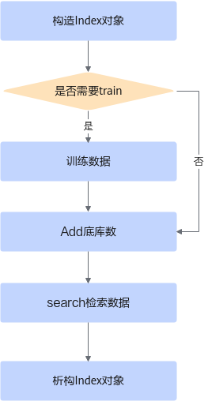
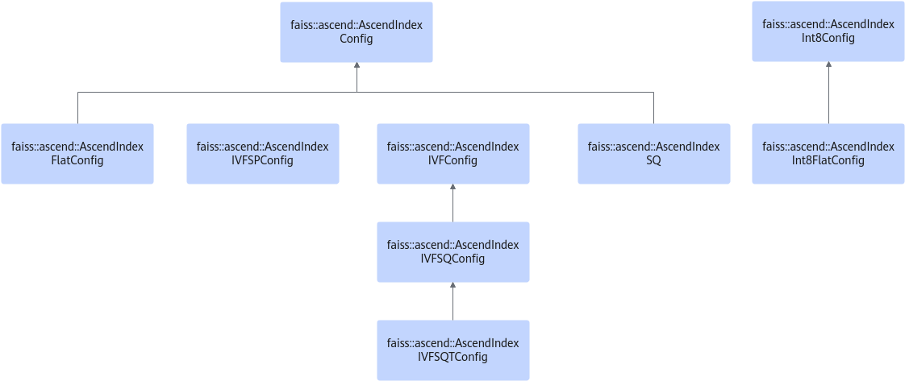
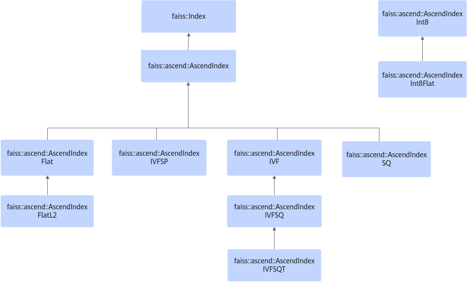

# API参考

|目录|导航链接|
|--|--|
|全量检索|[full_retrieval](./full_retrieval.md)|
|近似检索|[approximate_retrieval](./approximate_retrieval.md)|
|属性过滤检索|[attribute_filtering-based_retrieva](./attribute_filtering-based_retrieva.md)|
|多index批量检索|[multi-index_batch_retrieval](./multi-index_batch_retrieval.md)|
|其他功能|[more_functions](./more_functions.md)|
|未使用接口|[unused_apis](./unused_apis.md)|
|接口调用返回值参考|[return_code_reference](./return_code_reference.md)|

## 接口变更说明

本章节的接口变更说明包括新增、修改、删除和退出声明。接口变更只体现代码层面的修改，不包含文档本身在语言、格式、链接等方面的优化改进。

-   新增：表示此次版本新增的接口。
-   修改：表示本接口相比于上个版本有修改。
-   删除：表示该接口在此次版本已经删除。
-   退出声明：表示该接口自作出退出声明的版本起停止演进，且在声明一年后退出并删除。

|类名/API原型|变更类别|变更说明|变更版本|
|--|--|--|--|
|AscendIndexCluster的[Init](./full_retrieval.md#init接口)|修改|AscendIndexCluster算法Init接口resourceSize变量使用默认值128M。|6.0.RC2|
|AscendIndexBinaryFlat的AscendIndexBinaryFlat构造函数|修改|AscendIndexBinaryFlat构造函数新增参数usedFloat，用于设置入库为二进制、检索特征为float类型的检索方式（search接口）的性能提升。|6.0.RC2|
|AscendIndexBinaryFlat的[search接口](./approximate_retrieval.md#search接口)|新增|AscendIndexBinaryFlat新增入库特征为二进制特征，检索特征为float类型的检索方式。|6.0.RC2|
|AscendIndexInt8Flat的[AscendIndexInt8FlatConfig](./full_retrieval.md#ascendindexint8flatconfig)（表2）|修改|“resourceSize”配置的值不超过16 * 1024MB（16 * 1024 * 1024 * 1024字节）。|6.0.RC3|
|AscendIndexInt8Flat的[AscendIndexInt8FlatConfig](./full_retrieval.md#ascendindexint8flatconfig)（表3）|修改|“resourceSize”配置的值不超过16 * 1024MB（16 * 1024 * 1024 * 1024字节）|6.0.RC3|
|AscendIndexTS的[Init](./attribute_filtering-based_retrieva.md#init接口)|修改|修改“maxFeatureRowCount”参数约束。|6.0.RC3|
|AscendIndexInt8Flat的[setPageSize](./full_retrieval.md#setpagesize接口)|新增|设置该AscendIndexInt8Flat在search时一次性连续计算底库的block数量。|6.0.RC3|
|AscendIndexTS的[InitWithExtraVal](./attribute_filtering-based_retrieva.md#initwithextraval接口)|新增|实例带附加属性的初始化函数。|6.0.RC3|
|AscendIndexTS的[AddWithExtraVal](./attribute_filtering-based_retrieva.md#addwithextraval接口)|新增|添加附加属性特征接口。|6.0.RC3|
|AscendIndexTS的[GetBaseByRangeWithExtraVal](./attribute_filtering-based_retrieva.md#getbasebyrangewithextraval接口)|新增|基于范围查询带附加属性的底库。|6.0.RC3|
|AscendIndexTS的[GetExtraValAttrByLabel](./attribute_filtering-based_retrieva.md#getextravalattrbylabel接口)|新增|获取指定Label特征的属性。|6.0.RC3|
|AscendIndexTS的[ExtraValAttr](./attribute_filtering-based_retrieva.md#extravalattr)|新增|附加属性信息。|6.0.RC3|
|AscendIndexTS的[ExtraValFilter](./attribute_filtering-based_retrieva.md#extravalfilter)|新增|附加属性过滤器。|6.0.RC3|
|AscendIndexBinaryFlat的[setRemoveFast](./approximate_retrieval.md#setremovefast接口)|新增|AscendIndexBinaryFlat设置是否快速删除底库中的向量。|6.0.RC3|
|[AscendIndexVStar](./approximate_retrieval.md#ascendindexvstar)|新增|新增AscendIndexVStar新算法|6.0.RC3|
|[AscendIndexGreat](./approximate_retrieval.md#ascendindexgreat)|新增|新增AscendIndexGreat新算法|6.0.RC3|
|AscendIndexIVFSQT的[setSearchParams](./approximate_retrieval.md#setsearchparams接口)|新增|设置影响检索精度和性能的参数|6.0.RC3|
|AscendIndexIVFSQT的[setNumProbes](./approximate_retrieval.md#setnumprobes接口)|退出声明|预计2025年9月废除，请使用setSearchParams|6.0.RC3|
|AscendIndexIVFSQT的[updateTParams](./approximate_retrieval.md#updatetparams接口)|退出声明|预计2025年9月废除，请使用setSearchParams|6.0.RC3|
|AscendIndexTS的[SetSaveHostMemory](./attribute_filtering-based_retrieva.md#setsavehostmemory接口)|新增|设置使用节约host内存模式的接口|6.0.0|
|AscendIndex的[add](./full_retrieval.md#add接口)|新增|Flat算法新增支持FP16数据底库入库函数|6.0.0|
|AscendIndex的[add_with_ids](./full_retrieval.md#add_with_ids接口)|新增|Flat算法新增支持FP16数据底库带id入库函数|6.0.0|
|AscendIndex的[search](./full_retrieval.md#search接口)|新增|Flat算法新增支持FP16数据检索函数|6.0.0|
|AscendIndexFlat[search_with_masks](./full_retrieval.md#search_with_masks接口)|新增|Flat算法新增支持FP16数据带mask检索函数|6.0.0|
|AscendIndexIVFSP的[AscendIndexIVFSP](./approximate_retrieval.md#ascendindexivfsp)|新增|共享码本的构造函数|6.0.0|
|AscendIndexIVFSP的[saveAllData](./approximate_retrieval.md#savealldata接口)|新增|存储IVFSP数据至内存中|6.0.0|
|AscendIndexIVFSP的[loadAllData](./approximate_retrieval.md#loadalldata接口)|新增|从内存中恢复IVFSP|6.0.0|

## 调用流程与继承关系

> [!NOTE] 说明 
>Index SDK特征检索组件的C++接口遵循开源的Faiss接口的异常处理机制，故用户必须在**try**/**catch**语句块内进行调用以及异常处理，具体的处理范例请参见[代码参考](../appendix.md#代码参考)中的处理方式，防止在使用的过程中出现异常抛出导致程序退出的情况。

检索接口调用的基本流程如[图1 检索接口调用的基本流程](#fig7270141171511)所示。

**图 1**  检索接口调用的基本流程  

特征检索继承Faiss中的Index，并支持多种检索Index，提供建库、查询、删库等接口，对于各个对象间的继承关系如[图2 部分AscendIndexConfig间继承关系](#fig1028942114236)、[图3 部分AscendIndex间继承关系](#fig13557318153512)所示。

**图 2**  部分AscendIndexConfig间继承关系  

**图 3**  部分AscendIndex间继承关系  

> [!NOTE] 说明
>-   由于部分特征检索的输入为指针类型的输入，请用户确保此类指针为合法值，以防止特征检索的运行过程中可能产生的越界读写等潜在风险和问题。此外，特征检索是助力昇腾AI处理器完成向量检索计算，因此输入的Device ID需要用户确保为合法值，否则可能因为连接设备侧失败导致功能失效。
>-   [Faiss](https://github.com/facebookresearch/faiss)是在业界使用非常广泛的向量检索加速库，为了便于生态用户将向量检索聚类业务快速从CPU/GPU平台迁移到昇腾平台，昇腾平台众多算法的基类AscendIndex继承自faiss::Index类，faiss::Index类中d、ntotal等成员变量为public，在使用AscendIndex和AscendIndexInt8各子类过程中，请勿直接修改此类public成员变量。
>-   本文档不再描述基类faiss::Index的成员函数和变量。
>-   关于Config类中的resourceSize变量，其作用是预留特征检索过程存储中间结果的内存大小，单位为Byte，当底库特征较大（如超过300万）且查询请求数较大时需要调大，避免检索过程中因申请临时内存导致性能抖动（衰退），建议设置为1024 \* 1024 \* 1024 Byte。
>    创建新的Index时，将会与已申请的resources进行对比，如存在差异则会释放原有内存资源并参照最新Index的resources重新申请，建议保持Index整体的resources值一致。
>-   用户可以通过设置“MX\_INDEX\_SYNCHRONIZE\_STREAM\_TIME”环境变量设置算子执行的超时时间，单位为“ms”，取值范围\[60000, 1800000\]，默认为“300000”。

## 头文件列表说明

**表 1**  头文件列表

|头文件名称|所在目录|用途|
|--|--|--|
|AscendCloner.h|${mxIndex_install_path}/mxIndex/include/faiss/ascend/|该头文件提供了将NPU上的检索Index资源拷贝到CPU侧Faiss的操作，拷贝过程发生在内存中，原始NPU的Index上加载的数据会被拷贝到CPU侧的内存中，方便用户在CPU上使用相同的底库执行检索。|
|AscendClonerOptions.h|${mxIndex_install_path}/mxIndex/include/faiss/ascend/|AscendClonerOptions提供。|
|AscendIndex.h|${mxIndex_install_path}/mxIndex/include/faiss/ascend/|AscendIndex作为特征检索组件中的大部分检索的Index的基类，向上承接Faiss，向下为特征检索中的其他Index定义接口。|
|AscendIndexBinaryFlat.h|${mxIndex_install_path}/mxIndex/include/faiss/ascend/|AscendIndexBinaryFlat.h是汉明距离的接口类，定义汉明距离对外接口。|
|AscendIndexCluster.h|${mxIndex_install_path}/mxIndex/include/faiss/ascend/|AscendIndexCluster对外接口。|
|AscendIndexFlat.h|${mxIndex_install_path}/mxIndex/include/faiss/ascend/|该类主要提供Flat-FP16的对外接口。|
|AscendIndexIVF.h|${mxIndex_install_path}/mxIndex/include/faiss/ascend/|AscendIndexIVF是近似检索的基类，不能直接使用。|
|AscendIndexIVFSP.h|${mxIndex_install_path}/mxIndex/include/faiss/ascend/|该类提供IVFSP的对外接口，核心接口包括add，add_with_ids，search和search_with_filter。|
|AscendIndexIVFSQ.h|${mxIndex_install_path}/mxIndex/include/faiss/ascend/|IVFSQ对外接口，包括train，copyto，copyfrom，构造函数。|
|AscendIndexInt8.h|${mxIndex_install_path}/mxIndex/include/faiss/ascend/|AscendIndex作为特征检索组件中的int8类型的Index的基类，向上承接Faiss，向下为特征检索中的IndexInt8Flat定义接口。|
|AscendIndexInt8Flat.h|${mxIndex_install_path}/mxIndex/include/faiss/ascend/|该类主要提供Flat-Int8的对外接口。|
|AscendIndexSQ.h|${mxIndex_install_path}/mxIndex/include/faiss/ascend/|SQ检索的对外接口定义。|
|AscendIndexTS.h|${mxIndex_install_path}/mxIndex/include/faiss/ascend/|时空库对外接口，包括了汉明、int8Flat、FP16Flat三种算法。|
|AscendMultiIndexSearch.h|${mxIndex_install_path}/mxIndex/include/faiss/ascend/|提供多index检索的对外接口。|
|AscendNNInference.h|${mxIndex_install_path}/mxIndex/include/faiss/ascend/|神经网络降维对外接口。|
|AscendIndexIVFSQT.h|${mxIndex_install_path}/mxIndex/include/faiss/ascend/custom|包含降维算法带有模糊聚类功能的三级检索IVFSQ算法，将每个聚类簇再进行聚类，先根据一级聚类结果选出nprobe个簇，再在这些簇的所有二级聚类簇中选出l2nprobe个簇，再进行精搜。|
|IReduction.h|${mxIndex_install_path}/mxIndex/include/faiss/ascend/custom|IReduction是特征检索组件中降维方法的统一接口，目前支持**PCAR**和**NN**两种降维算法。|
|Version.h|${mxIndex_install_path}/mxIndex/include/faiss/ascend/utils|获取版本信息接口。|
|ErrorCode.h|${mxIndex_install_path}/mxIndex/device/include|包含Index SDK错误码信息。|
|IndexILFlat.h|${mxIndex_install_path}/mxIndex/device/include|IndexILFlat对外接口定义。|
|IndexIL.h|${mxIndex_install_path}/mxIndex/device/include|IndexILFlat的基类，不能直接使用。|
|AscendIndexGreat.h|${mxIndex_install_path}/mxIndex/include/faiss/ascend/|Great检索的对外接口定义。|
|AscendIndexVStar.h|${mxIndex_install_path}/mxIndex/include/faiss/ascend/|VStar检索的对外接口定义。|
|AscendIndexMixSearchParams.h|${mxIndex_install_path}/mxIndex/include/faiss/ascend/|Vstar和Great检索所需的参数结构体对外头文件。|

> [!NOTE] 说明 
>$\{mxIndex\_install\_path\}表示Index SDK的安装路径。

