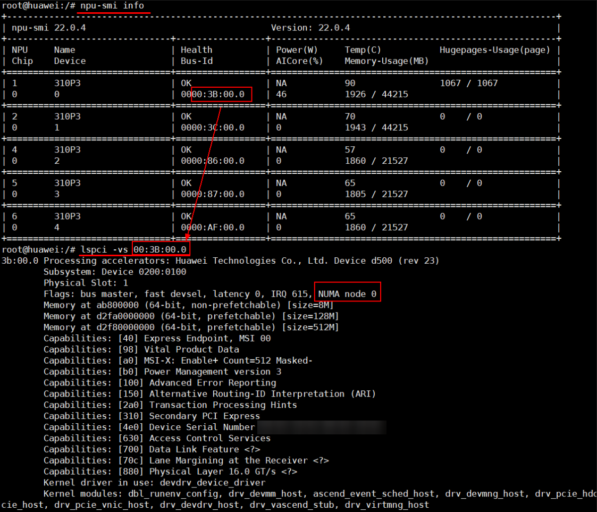
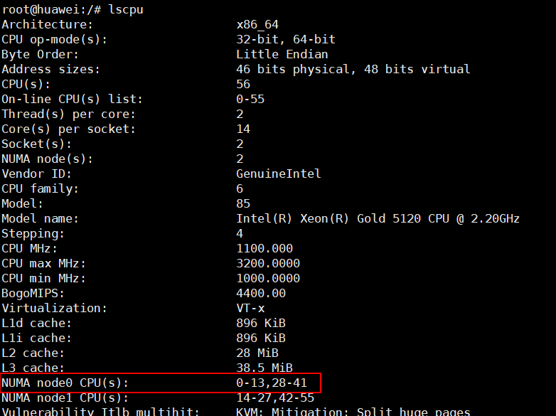

# FAQ<a name="ZH-CN_TOPIC_0000001506414777"></a>

## 升级Faiss1.10.0常见问题<a name="ZH-CN_TOPIC_0000002248120594"></a>

### 编译Faiss 1.10.0时，CMake出现报错信息<a name="ZH-CN_TOPIC_0000002287047945"></a>

**问题现象<a name="section428442235616"></a>**

编译Faiss 1.10.0时，出现报错信息，提示“CMake 3.24.0 or higher is required”。

**问题原因<a name="section243812295615"></a>**

当前CMake的版本过低，Faiss 1.10.0需要配套CMake 3.24.0及以上版本。

**解决方案<a name="section18586112214564"></a>**

安装CMake 3.24.0或以上版本。以安装CMake 3.24.0版本为例：

-   x86环境：
    1.  获取CMake安装脚本。

        ```
        wget https://github.com/Kitware/CMake/releases/download/v3.24.0/cmake-3.24.0-linux-x86_64.sh
        ```

    2.  运行安装脚本。

        ```
        bash ./cmake-3.24.0-linux-x86_64.sh --skip-license --prefix=/usr
        ```

        ```
        # 安装过程中遇到：
        # 选择1
        Do you accept the license? [y/n]: 
        # 输入 y
        # 选择2
        By default the CMake will be installed in:
          "/usr/cmake-3.24.0-linux-x86_64"
        Do you want to include the subdirectory cmake-3.24.0-linux-x86_64?
        Saying no will install in: "/usr" [Y/n]:
        # 输入 n
        ```

    3.  查看CMake版本。

        ```
        cmake --version
        ```

        显示当前的CMake版本：

        ```
        cmake version 3.24.0
        ```

-   aarch64环境：
    1.  获取CMake安装脚本。

        ```
        wget https://github.com/Kitware/CMake/releases/download/v3.24.0/cmake-3.24.0-linux-aarch64.sh
        ```

    2.  运行安装脚本。

        ```
        bash ./cmake-3.24.0-linux-aarch64.sh --skip-license --prefix=/usr
        ```

        ```
        # 安装过程中遇到：
        # 选择1
        Do you accept the license? [y/n]: 
        # 输入 y
        # 选择2
        By default the CMake will be installed in:
          "/usr/cmake-3.24.0-linux-aarch64"
        Do you want to include the subdirectory cmake-3.24.0-linux-aarch64?
        Saying no will install in: "/usr" [Y/n]:
        # 输入 n
        ```

    3.  查看CMake版本。

        ```
        cmake --version
        ```

        显示当前的CMake版本：

        ```
        cmake version 3.24.0
        ```


## 生成算子常见问题<a name="ZH-CN_TOPIC_0000002283337613"></a>

### 提示MemoryError错误或者multiprocessing报错<a name="ZH-CN_TOPIC_0000002252470708"></a>

**问题现象<a name="section107775370219"></a>**

生成算子时，发生报错，提示MemoryError错误或者multiprocessing报错。

**问题原因<a name="section11777103713218"></a>**

生成算子的过程中资源不足。

**解决方案<a name="section1477773713218"></a>**

在运行算子生成脚本时通过降低“-pool“参数值，重新运行脚本，可从**-pool 1**开始尝试设置。


### NumPy的数据类型np.float\_ 已被移除<a name="ZH-CN_TOPIC_0000002252367678"></a>

**问题现象<a name="section428442235616"></a>**

生成算子时出现类似如下错误：

Failed to import Python module \[AttributeError: \`np.float\_\` was removed in the NumPy 2.0 release. Use \`np.float64\` instead..\].

**问题原因<a name="section243812295615"></a>**

Python3.9及以上版本默认安装NumPy 2.0版本，但CANN目前未适配NumPy 2.0。

**解决方案<a name="section18586112214564"></a>**

将NumPy版本更换到1.26。

```
pip3 install numpy==1.26
```


### 生成距离算子ATC报错<a name="ZH-CN_TOPIC_0000002287047949"></a>

**问题现象<a name="section238219259714"></a>**

生成距离算子时，ATC出现以下报错：

Call InferShapeAndType for nodeXXXX failed

**问题原因<a name="section147095251275"></a>**

新版CANN加强了校验，InferDataType实现不可缺少。

**解决方案<a name="section19641271973"></a>**

可以设置以下环境变量进行规避：

```
export IGNORE_INFER_ERROR=1
```


### 分配内存失败<a name="ZH-CN_TOPIC_0000002287001045"></a>

**问题现象<a name="section1227510447314"></a>**

生成算子失败，报错信息.../libgomp.so: cannot allocate memory in static TLS block。

**问题原因<a name="section1275154417319"></a>**

在低版本的OS上存在gcc相关bug，该bug官方说明可参见[链接](https://gcc.gnu.org/bugzilla/show_bug.cgi?id=91938)。

**解决方案<a name="section027514410318"></a>**

请执行以下命令导入环境变量。

```
export LD_PRELOAD={…/libgomp.so}  # 请将{}里的内容替换成libgomp.so文件的实际路径
```


### openEuler24.03操作系统下生成算子失败<a name="ZH-CN_TOPIC_0000002356700501"></a>

**问题现象<a name="section238219259714"></a>**

openEuler24.03操作系统下，生成算子失败，报错：fatal error: 'cstdint' file not found。

**问题原因<a name="section147095251275"></a>**

问题原因可参见《CANN 软件安装指南》中的“执行ATC转换或模型训练时，报错：fatal error: 'cstdint' file not found”章节中的“可能原因”部分。

**解决方案<a name="section19641271973"></a>**

执行以下命令导入环境变量可解决以上问题。

```
export CPLUS_INCLUDE_PATH=/usr/include/c++/12:/usr/include/c++/12/aarch64-openEuler-linux:$CPLUS_INCLUDE_PATH
```


## 运行推理常见问题<a name="ZH-CN_TOPIC_0000002283277033"></a>

### 程序退出时段错误或者TBE报错<a name="ZH-CN_TOPIC_0000002252470712"></a>

**问题现象<a name="section428442235616"></a>**

检索进程执行结束后，程序退出时报错，出现“segmentation fault”或者TBE报错等提示。

**问题原因<a name="section243812295615"></a>**

可能是由于用户的业务进程中，有别的组件使用了ACL资源并调用aclFinalize进行释放，从而导致ACL资源重复释放。

**解决方案<a name="section18586112214564"></a>**

可以设置环境变量“MX\_INDEX\_FINALIZE”为0，则Index SDK不调用aclFinalize；设置为“1“表示仍调用aclFinalize。其他为无效设置。

用户需要确保进程退出时调用一次aclFinalize进行释放，否则仍可能在进程退出时出现错误。


### 查询条数大于1000时，出现性能波动<a name="ZH-CN_TOPIC_0000002252367682"></a>

**问题现象<a name="section7388731387"></a>**

执行查询操作，当查询的条数大于100时，出现了性能波动。

**问题原因<a name="section2012040380"></a>**

Host侧CPU并发处理时，调度到非亲和性的CPU核上，导致耗时增加。

**解决方案<a name="section277318351005"></a>**

需对检索应用进行绑核操作，具体过程参考如下。

1.  获取对应的NUMA node信息。如[图1](#fig7992105655611)可以看到当前查询的NPU属于“NUMA node 0“。

    **图 1**  获取NUMA node信息<a id="fig7992105655611"></a>  
    

2.  使用**lscpu**查看NUMA node 0上包含的CPU核信息，如[图2](#fig1614971412517)所示，可以看到“NUMA node 0“所拥有的CPU核为“0-13,28-41“。

    **图 2**  使用命令确认CPU核信息<a id="fig1614971412517"></a>  
    

3.  对当前的检索应用与确认完成的CPU进行绑核，命令参考如下。

    ```
    taskset -c 0-13,28-41 ./mxIndexApp
    ```

    其中，_mxIndexApp_为待绑定的检索应用，请根据实际应用名称进行替换。


## 编译常见问题<a name="ZH-CN_TOPIC_0000002248358794"></a>

### 提示**libascendfaiss.so not found**<a name="ZH-CN_TOPIC_0000002287047953"></a>

**问题现象<a name="section238219259714"></a>**

编译过程中，出现提示**libascendfaiss.so not found**。

**问题原因<a name="section147095251275"></a>**

未能通过环境变量中的路径找到“libascendfaiss.so“文件。

**解决方案<a name="section19641271973"></a>**

请确认“libascendfaiss.so“的路径（位于安装包host/lib下），并将其添加进“LD\_LIBRARY\_PATH“环境变量中。


### 链接libfaiss.so时，返回**undefined reference**错误。<a name="ZH-CN_TOPIC_0000002287001049"></a>

在openEuler release 22.03 \(LTS\)系统中，通过系统默认的Cmake和gcc编译安装Faiss后，在链接“libfaiss.so“时，返回**undefined reference**错误。

**问题原因<a name="section5819920577"></a>**

openEuler release 22.03 \(LTS\)系统默认安装或使用yum工具安装的Cmake存在兼容性问题。

**解决方案<a name="section1165542813712"></a>**

请访问组件官网，获取对应版本的Cmake源码，重新编译安装。


