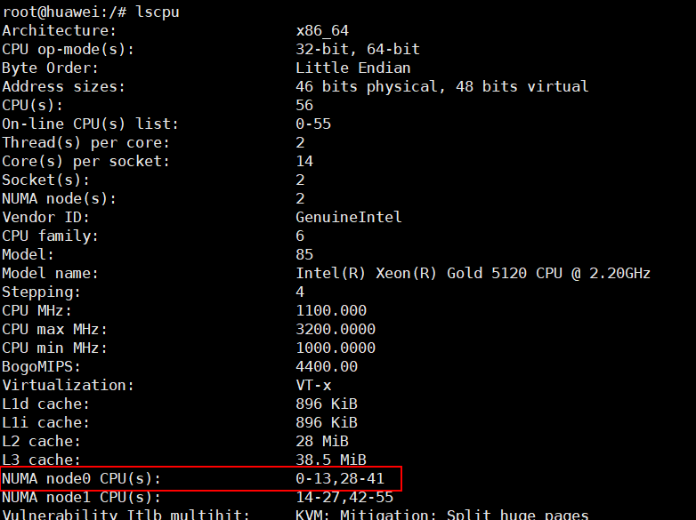

# FAQ<a name="ZH-CN_TOPIC_0000001506414777"></a>

本文档收录了IndexSDK的常见问题及解答。您也可以查阅 [GitCode Issues](https://gitcode.com/Ascend/IndexSDK/issues) 获取更多问题解决方案。若仍未找到答案，欢迎[新建 Issue](https://gitcode.com/Ascend/IndexSDK/issues/create/choose) 提问。

## 升级Faiss1.10.0常见问题<a name="ZH-CN_TOPIC_0000002248120594"></a>

### 编译Faiss 1.10.0时，CMake出现报错信息<a name="ZH-CN_TOPIC_0000002287047945"></a>

**问题现象<a name="section428442235616"></a>**

编译Faiss 1.10.0时，出现报错信息，提示“CMake 3.24.0 or higher is required”。

**问题原因<a name="section243812295615"></a>**

当前CMake的版本过低，Faiss 1.10.0需要配套CMake 3.24.0及以上版本。

**解决方案<a name="section18586112214564"></a>**

安装CMake 3.24.0或以上版本。以安装CMake 3.24.0版本为例：

- x86环境：
    1. 获取CMake安装脚本。

        ```bash
        wget https://github.com/Kitware/CMake/releases/download/v3.24.0/cmake-3.24.0-linux-x86_64.sh
        ```

    2. 运行安装脚本。

        ```bash
        bash ./cmake-3.24.0-linux-x86_64.sh --skip-license --prefix=/usr
        ```

        ```bash
        # 安装过程中遇到：
        # 选择1
        Do you accept the license? [y/n]:
        # 输入 y
        # 选择2
        By default the CMake will be installed in:
          "/usr/cmake-3.24.0-linux-x86_64"
        Do you want to include the subdirectory cmake-3.24.0-linux-x86_64?
        Saying no will install in: "/usr" [Y/n]:
        # 输入 n
        ```

    3. 查看CMake版本。

        ```bash
        cmake --version
        ```

        显示当前的CMake版本：

        ```text
        cmake version 3.24.0
        ```

- aarch64环境：
    1. 获取CMake安装脚本。

        ```bash
        wget https://github.com/Kitware/CMake/releases/download/v3.24.0/cmake-3.24.0-linux-aarch64.sh
        ```

    2. 运行安装脚本。

        ```bash
        bash ./cmake-3.24.0-linux-aarch64.sh --skip-license --prefix=/usr
        ```

        ```bash
        # 安装过程中遇到：
        # 选择1
        Do you accept the license? [y/n]:
        # 输入 y
        # 选择2
        By default the CMake will be installed in:
          "/usr/cmake-3.24.0-linux-aarch64"
        Do you want to include the subdirectory cmake-3.24.0-linux-aarch64?
        Saying no will install in: "/usr" [Y/n]:
        # 输入 n
        ```

    3. 查看CMake版本。

        ```bash
        cmake --version
        ```

        显示当前的CMake版本：

        ```text
        cmake version 3.24.0
        ```

### IVFSQT算法在添加较大底库后，update接口性能下降

**问题现象<a name="section428442235616"></a>**

从Faiss 1.7.1版本升级到Faiss 1.10.0版本后，IVFSQT算法在添加较大底库后，update接口性能下降。

**问题原因<a name="section243812295615"></a>**

IVFSQT算法在添加较大底库后，update接口会使用IndexFlat来进行CPU聚类。IndexFlat在Faiss 1.7.1版本中，使用了exhaustive_L2sqr_seq接口；在Faiss 1.10.0版本中，exhaustive_L2sqr_seq添加了omp的线程数约束，导致了性能下降。

**解决方案<a name="section18586112214564"></a>**

Faiss源码的exhaustive_L2sqr_seq接口中去掉omp的num_threads(nt)约束后，重新编译安装Faiss 1.10.0版本。多卡场景可设置export OMP_NUM_THREADS=2。

## 生成算子常见问题<a name="ZH-CN_TOPIC_0000002283337613"></a>

### 提示MemoryError错误或者multiprocessing报错<a name="ZH-CN_TOPIC_0000002252470708"></a>

**问题现象<a name="section107775370219"></a>**

生成算子时，发生报错，提示MemoryError错误或者multiprocessing报错。

**问题原因<a name="section11777103713218"></a>**

生成算子的过程中资源不足。

**解决方案<a name="section1477773713218"></a>**

在运行算子生成脚本时通过降低“-pool”参数值，重新运行脚本，可从**-pool 1**开始尝试设置。

### NumPy的数据类型np.float\_ 已被移除<a name="ZH-CN_TOPIC_0000002252367678"></a>

**问题现象<a name="section428442235616"></a>**

生成算子时出现类似如下错误：

Failed to import Python module \[AttributeError: \`np.float\_\` was removed in the NumPy 2.0 release. Use \`np.float64\` instead.\].

**问题原因<a name="section243812295615"></a>**

Python3.9及以上版本默认安装NumPy 2.0版本，但CANN目前未适配NumPy 2.0。

**解决方案<a name="section18586112214564"></a>**

将NumPy版本更换到1.26。

```bash
pip3 install numpy==1.26
```

### 生成距离算子ATC报错<a name="ZH-CN_TOPIC_0000002287047949"></a>

**问题现象<a name="section238219259714"></a>**

生成距离算子时，ATC出现以下报错：

Call InferShapeAndType for nodeXXXX failed

**问题原因<a name="section147095251275"></a>**

新版CANN加强了校验，InferDataType实现不可缺少。

**解决方案<a name="section19641271973"></a>**

可以设置以下环境变量进行规避：

```bash
export IGNORE_INFER_ERROR=1
```

### 分配内存失败<a name="ZH-CN_TOPIC_0000002287001045"></a>

**问题现象<a name="section1227510447314"></a>**

生成算子失败，报错信息.../libgomp.so: cannot allocate memory in static TLS block。

**问题原因<a name="section1275154417319"></a>**

在低版本的OS上存在gcc相关bug，该bug官方说明可参见[链接](https://gcc.gnu.org/bugzilla/show_bug.cgi?id=91938)。

**解决方案<a name="section027514410318"></a>**

请执行以下命令导入环境变量。

```bash
export LD_PRELOAD={…/libgomp.so}  # 请将{}里的内容替换成libgomp.so文件的实际路径
```

### 部分操作系统下生成算子失败<a name="ZH-CN_TOPIC_0000002356700501"></a>

**问题现象<a name="section238219259714"></a>**

部分操作系统下，生成算子失败，报错：fatal error: 'cstdint' file not found 或 fatal error: 'cstdio' file not found。

**问题原因<a name="section147095251275"></a>**

问题原因一：可参见《CANN 软件安装指南》中的“[执行ATC转换或模型训练时，报错：fatal error: 'cstdint' file not found](https://www.hiascend.com/document/detail/zh/canncommercial/900/softwareinst/instg/instg_0086.html)”章节中的“可能原因”部分。

问题原因二：在部分特定系统中，该问题源于操作系统发行版的工具链命名差异。昇腾 CANN 软件栈在构建算子时，默认会去查找标准的 aarch64-linux-gnu 工具链目录以获取 C++ 标准库头文件。然而，在部分特定操作系统（kylin、openEuler、ctyunos）中，为了区分特定的系统 ABI，其工具链目录被重命名（例如 aarch64-kylin-linux）。由于 CANN 编译器未在默认路径中找到对应的头文件，从而导致编译中断。

**解决方案<a name="section19641271973"></a>**

您需要手动将系统实际的 C++ 头文件路径添加到环境变量 CPLUS_INCLUDE_PATH 中，以指引编译器找到正确的文件。以 Kylin 系统（GCC 12）为例，请执行以下命令：

```bash
export CPLUS_INCLUDE_PATH=/usr/include/c++/12/aarch64-kylin-linux:/usr/include/c++/12:$CPLUS_INCLUDE_PATH
```

## 运行推理常见问题<a name="ZH-CN_TOPIC_0000002283277033"></a>

### 程序退出时段错误或者TBE报错<a name="ZH-CN_TOPIC_0000002252470712"></a>

**问题现象<a name="section428442235616"></a>**

检索进程执行结束后，程序退出时报错，出现“segmentation fault”或者TBE报错等提示。

**问题原因<a name="section243812295615"></a>**

可能是由于用户的业务进程中，有别的组件使用了ACL资源并调用aclFinalize进行释放，从而导致ACL资源重复释放。

**解决方案<a name="section18586112214564"></a>**

可以设置环境变量“MX\_INDEX\_FINALIZE”为0，则Index SDK不调用aclFinalize；设置为“1”表示仍调用aclFinalize。其他为无效设置。

用户需要确保进程退出时调用一次aclFinalize进行释放，否则仍可能在进程退出时出现错误。

### 查询条数大于1000时，出现性能波动<a name="ZH-CN_TOPIC_0000002252367682"></a>

**问题现象<a name="section7388731387"></a>**

执行查询操作，当查询的条数大于1000时，出现了性能波动。

**问题原因<a name="section2012040380"></a>**

Host侧CPU并发处理时，调度到非亲和性的CPU核上，导致耗时增加。

**解决方案<a name="section277318351005"></a>**

需对检索应用进行绑核操作，具体过程参考如下。

1. 获取对应的NUMA node信息。如[图1](#fig7992105655611)可以看到当前查询的NPU属于“NUMA node 0”。

    **图 1**  获取NUMA node信息<a id="fig7992105655611"></a>
    

2. 使用**lscpu**查看NUMA node 0上包含的CPU核信息，如[图2](#fig1614971412517)所示，可以看到“NUMA node 0”所拥有的CPU核为“0-13,28-41”。

    **图 2**  使用命令确认CPU核信息<a id="fig1614971412517"></a>
    

3. 对当前的检索应用与确认完成的CPU进行绑核，命令参考如下。

    ```bash
    taskset -c 0-13,28-41 ./mxIndexApp
    ```

    其中，mxIndexApp为待绑定的检索应用，请根据实际应用名称进行替换。

## 编译常见问题<a name="ZH-CN_TOPIC_0000002248358794"></a>

### 提示**libascendfaiss.so not found**<a name="ZH-CN_TOPIC_0000002287047953"></a>

**问题现象<a name="section238219259714"></a>**

编译过程中，出现提示**libascendfaiss.so not found**。

**问题原因<a name="section147095251275"></a>**

未能通过环境变量中的路径找到“libascendfaiss.so”文件。

**解决方案<a name="section19641271973"></a>**

请确认“libascendfaiss.so”的路径（位于安装包host/lib下），并将其添加进“LD\_LIBRARY\_PATH”环境变量中。

### 链接libfaiss.so时，返回**undefined reference**错误。<a name="ZH-CN_TOPIC_0000002287001049"></a>

在openEuler release 22.03 \(LTS\)系统中，通过系统默认的Cmake和gcc编译安装Faiss后，在链接“libfaiss.so”时，返回**undefined reference**错误。

**问题原因<a name="section5819920577"></a>**

openEuler release 22.03 \(LTS\)系统默认安装或使用yum工具安装的Cmake存在兼容性问题。

**解决方案<a name="section1165542813712"></a>**

请访问组件官网，获取对应版本的Cmake源码，重新编译安装。

## IVFRaBitQ 检索精度问题<a name="ivfrabitq-recall-low-nlist-10048"></a>

### AscendIndexIVFRaBitQ 在 nlist=10048 场景下 recall 显著低于 CPU<a name="ivfrabitq-recall-low-symptom"></a>

**问题现象<a name="ivfrabitq-recall-low-symptom-section"></a>**

使用 AscendIndexIVFRaBitQ，`coarse_centroid_num`（nlist）设为 10048 或其他大于 2512 的值时，`copyFrom` 后 NPU search 的 recall@K 明显低于 CPU baseline；nlist ≤ 8192 的控制组可能正常。

**问题原因<a name="ivfrabitq-recall-low-cause"></a>**

常见根因包括：

1. **RotateAndL2AtFP32 算子 GEMM tiling 与多核分核不一致**：coarse centroid 仅前约 2512 行（单 AIC core batch）被正确旋转写入 device，row ≥ 2512 为零，导致 IVF 粗排 probe 选择失效。
2. **L1 距离算子 8192 codes tile 边界问题**：第二个及后续 tile 距离缺失 query norm 项。
3. **custom opp 未重新编译部署**：修改 host tiling 或 kernel 后仍运行旧版算子。

**解决方案<a name="ivfrabitq-recall-low-fix"></a>**

1. 确认已应用相关修复并**重新编译部署** custom opp。
2. 使用运行时诊断分阶段定位：

    ```bash
    # 步骤 1：验证 coarse center 上传（copyFrom 阶段）
    export IVFRABITQ_VERIFY_COARSE_CENTER=1
    # 运行 copyFrom 场景，检查 zeroRowsAfter2512 是否为 0

    # 步骤 2：若 centroid 正常，检查 L1 probe 分布（search 阶段）
    export IVFRABITQ_DEBUG_L1_PROBE=stats
    # 确认 in[8192,nlist) > 0（视数据分布而定）

    # 步骤 3：深度对比 L1 8192 边界距离
    export IVFRABITQ_VERIFY_L1_DIST=1
    ```

3. 完整操作说明见《[常用操作 — IVFRaBitQ 运行时诊断](./common_operations.md#ivfrabitq-runtime-debug)》。

## 浮点数计算精度问题

### 使用NPU聚类时结果与CPU聚类结果不完全一致

聚类时，有些点到两个聚类中心的距离几乎相等，由于浮点数计算存在百万分之一的误差（faiss CPU版本详见：https://github.com/facebookresearch/faiss/issues/297）， 会导致这些向量归属的聚类簇不确定，这种误差在多次迭代后得到放大，所以NPU聚类与CPU聚类的结果不完全一致，在与CPU对比一致性的时候，应统一使用cpu聚类。
