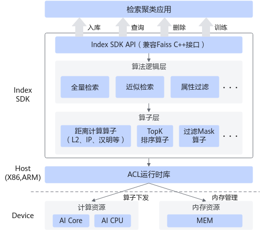

# 简介

**产品背景**

随着近些年人工智能技术的发展，可以通过先进的算法模型有效地提取出图像、文本、语音等非结构化数据中的特征表示，即结构化的向量特征。在实际应用场景下，如何快速准确的找出与待查询向量相似的向量已经成为各种智能化应用的重要诉求，这就需要提供一个高效的基于向量特征的检索系统，该系统的核心之一便是高效的检索引擎。

在此背景下，基于华为昇腾平台Index SDK实现了一个高效的向量特征检索引擎，用户可以在此引擎上实现面向应用场景的检索系统。

**产品定义**

特征检索（FeatureRetrieval）是基于Faiss开发的昇腾NPU异构检索加速框架，针对高维空间中的海量数据，提供高性能的检索，采用与Faiss风格一致的C++语言结合TBE算子开发，支持ARM和x86\_64平台。特征检索支持的检索库类型分为<b>小库搜索（全量检索）</b>和<b>大库搜索（近似检索）</b>，小库规模通常在30万\~100万条的量级，而大库规模可达到千万甚至亿级别，覆盖支持的特征向量维度从64维到512维向量等（具体算法略有不同）。

-   <b>小库搜索（全量检索）</b>主要实现了Flat、SQ、INT8等暴力检索算法，对于底库中的特征向量采取全量搜索并返回TopK个距离排序结果。
    -   INT8算法在特征量化的基础上进行暴力检索，因此也叫“int8flat”（如：算子生成脚本，int8flat\_generate\_model.py）。
    -   SQ算法在内部进行量化，因使用8位整型进行量化，因此也叫“SQ8”（如：sq8\_generate\_model.py）。

-   <b>大库搜索（近似检索）</b>在Ascend平台基于Faiss特征检索框架和IVF的思路实现的IVFSQ算法，此处IVF与传统的“倒排索引”有所区别，其基本思想是对特征先做聚类，然后通过聚类中心缩小检索范围，是一种用精度换性能的方法。

各算法底层通过Ascend平台进行加速的TBE算子来进行实现。

除此之外，特征检索还支持属性过滤检索，多Index批量检索。

-   **属性过滤检索**可在底库向量数据入库过程中，添加一些时间和空间相关的属性并在进行检索时，通过特定时间和空间下的底库数据做检索。
-   **多Index批量检索**支持用户使用多个Index进行分库并在执行检索时，通过统一的接口，一次检索多个Index底库。

**产品价值**

Index作为高性能向量检索SDK，具有以下价值：

-   兼容主流框架：Faiss原生API，开箱即用。
-   高性能：同等算力卡下全量检索性能优于业界，批量检索性能优于串行场景。
-   大容量内存：支持单卡亿级底库的向量检索。

# 软件架构

Index SDK软件架构如[图 软件架构](#fig883164172512)所示，架构图中的关键模块介绍如[表 Index SDK模块介绍](#table3548152713258)。

**图 1**  软件架构  

**表 1** Index SDK模块介绍

|模块|说明|
|--|--|
|Index SDK API层|提供兼容Faiss的C++接口，上层应用可以实现入库、查询、删除特征以及训练功能。|
|算法逻辑层|实现检索算法的逻辑流程，当前支持的算法主要包括暴力检索、近似检索以及属性过滤算法等。|
|算子层|基于昇腾平台实现检索算法的加速算子，包括距离计算算子、TopK排序算子以及过滤Mask属性算子等。|

# 学习向导

**使用流程**

如[图 Index SDK使用流程](#fig15421350143413)所示，使用Index SDK进行特征检索可分为以下环节。

**图 1** Index SDK使用流程  

1.  安装部署。
    1.  了解Index SDK支持的产品硬件形态和系统，可参见“[支持的硬件和操作系统](#支持的硬件和操作系统)”。
    2.  了解相关依赖的部署安装，可参见“[安装依赖](./installation_guide.md#安装依赖)”。
    3.  获取并验证Index SDK软件包，可参见“[获取Index SDK软件包](./installation_guide.md#获取index-sdk软件包)”。
    4.  了解并完成Index SDK安装部署，可参见“[安装Index SDK](./installation_guide.md#安装index-sdk)”。

2.  确定检索类型与算法。

    了解Index SDK支持的检索类型和每种检索类型包含的算法，包括各个算法的使用场景，需要生成的算子以及样例介绍。根据自身实际业务分析确定需要使用的检索类型和算法。可参见“[算法介绍](./user_guide.md#算法介绍)”。

3.  生成算子。

    生成算法所需要的算子，可参见“[生成算子](./user_guide.md#生成算子)”。

4.  调用接口实现算法，得到检索结果，可参见“[API参考](./api/README.md)”。

**使用须知**

-   当前的Index SDK特征检索（FeatureRetrieval）基于昇腾AI处理器以及开源相似性检索框架Faiss开发和适配，对于任何其他硬件或者异构计算平台的兼容性不在本文档或产品的范围内。
-   特征检索的部署方式是基于AscendCL接口实现的，因此已经在内部进行了aclInit接口的调用，用户无需再次调用。
-   当前单个Index（底库）支持最大库容视具体昇腾AI处理器Device侧内存大小而定，业务侧需要根据实际需求规划Index个数，防止内存超限情形发生。建议创建Index的数量小于10000个，超过10000个后所产生的内存碎片较多，可能会导致add操作的容量小于预期值。

# 支持的硬件和操作系统

<table>
<tr>
<th>产品系列</th>
<th>产品型号</th>
<th>操作系统版本（仅支持64位的操作系统）</th>
</tr>
<tr>
<td rowspan="5">Atlas 推理系列产品</td>
<td>Atlas 300I Pro 推理卡</td>
<td><li>CentOS 7.6<li>openEuler 20.03<li>
openEuler 22.03<li>openEuler 24.03<li>Ubuntu 18.04<li>Ubuntu 20.04<li>EulerOS 2.12<li>EulerOS 2.15<li>KylinOS V10 SP3 2403<li>KylinOS V11<li>CTyunOS 23.01<li>UOS V20</td>
</tr>
<tr>
<td>Atlas 300V 视频解析卡</td>
<td><li>CentOS 7.6<li>openEuler 20.03<li>openEuler 22.03<li>Ubuntu 18.04<li>Ubuntu 20.04<li>EulerOS 2.12<li>UOS V20</td>
</tr>
<tr>
<td>Atlas 300V Pro 视频解析卡</td>
<td><li>CentOS 7.6<li>openEuler 20.03<li>openEuler 22.03<li>openEuler 24.03<li>Ubuntu 18.04<li>Ubuntu 20.04<li>EulerOS 2.12<li>CTyunOS 23.01<li>UOS V20</td>
</tr>
<tr>
<td>Atlas 300I Duo 推理卡</td>
<td><li>CentOS 7.6<li>Ubuntu 18.04<li>Ubuntu 20.04<li>EulerOS 2.12<li>EulerOS 2.15<li>KylinOS V10 SP3 2403<li>KylinOS V11<li>openEuler 24.03<li>CTyunOS 23.01<li>UOS V20</td>
</tr>
<tr>
<td>Atlas 200I SoC A1 核心板</td>
<td><li>CentOS 7.6<li>openEuler 20.03<li>EulerOS 2.12</td>
</tr>
<tr>
<td rowspan="2">Atlas 200/300/500 推理产品</td>
<td>Atlas 300I 推理卡（型号 3000）</td>
<td><li>CentOS 7.6<li>openEuler 20.03<li>openEuler 22.03<li>Ubuntu 18.04<li>Ubuntu 20.04<li>EulerOS 2.12<li>UOS V20</td>
</tr>
<tr>
<td>Atlas 300I 推理卡（型号 3010）</td>
<td><li>CentOS 7.6<li>openEuler 20.03<li>openEuler 22.03<li>Ubuntu 18.04<li>Ubuntu 20.04<li>EulerOS 2.12<li>UOS V20</td>
</tr>
<tr>
<td >Atlas A2 推理系列产品
 说明：vAtlas A2 推理系列产品支持AscendIndexFlat及AscendIndexInt8Flat算法。</td>
<td>Atlas 800I A2 推理服务器</td>
<td><li>CentOS 7.6<li>openEuler 20.03<li>openEuler 22.03<li>openEuler 24.03<li>Ubuntu 18.04<li>Ubuntu 20.04<li>Ubuntu 24.04<li>EulerOS 2.12<li>UOS V20<li>KylinOS V10 SP3<li>KylinOS V11<li>BC-Linux_21.10 U4</td>
</tr>
<tr>
<td >Atlas A3 推理系列产品 说明：当前仅支持AscendIndexFlat算法。</td>
<td>Atlas 800I A3 超节点服务器</td>
<td><li>CUbuntu 18.04<li>CUlinux 3.0<li>KylinOS V10 SP3 2403<li>KylinOS V11</td>
</tr>
</table>
