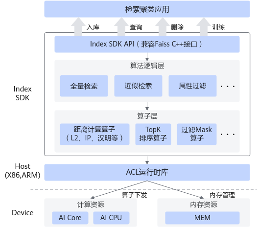

# 简介

## Index SDK 简介

**产品背景**

随着近些年人工智能技术的发展，可以通过先进的算法模型有效地提取出图像、文本、语音等非结构化数据中的特征表示，即结构化的向量特征。在实际应用场景下，如何快速准确的找出与待查询向量相似的向量已经成为各种智能化应用的重要诉求，这就需要提供一个高效的基于向量特征的检索系统，该系统的核心之一便是高效的检索引擎。

在此背景下，基于华为昇腾平台Index SDK实现了一个高效的向量特征检索引擎，用户可以在此引擎上实现面向应用场景的检索系统。

**产品定义**

特征检索（FeatureRetrieval）是基于Faiss开发的昇腾NPU异构检索加速框架，针对高维空间中的海量数据，提供高性能的检索，采用与Faiss风格一致的C++语言结合TBE算子开发，支持ARM和x86\_64平台。特征检索支持的检索库类型分为<b>小库搜索（全量检索）</b>和<b>大库搜索（近似检索）</b>，小库规模通常在30万\~100万条的量级，而大库规模可达到千万甚至亿级别，覆盖支持的特征向量维度从64维到512维向量等（具体算法略有不同）。

- <b>小库搜索（全量检索）</b>主要实现了Flat、SQ、INT8等暴力检索算法，对于底库中的特征向量采取全量搜索并返回TopK个距离排序结果。
    - INT8算法在特征量化的基础上进行暴力检索，因此也叫“int8flat”（如：算子生成脚本，int8flat\_generate\_model.py）。
    - SQ算法在内部进行量化，因使用8位整型进行量化，因此也叫“SQ8”（如：sq8\_generate\_model.py）。

- <b>大库搜索（近似检索）</b>在Ascend平台基于Faiss特征检索框架和IVF的思路实现的IVFSQ算法，此处IVF与传统的“倒排索引”有所区别，其基本思想是对特征先做聚类，然后通过聚类中心缩小检索范围，是一种用精度换性能的方法。

各算法底层通过Ascend平台进行加速的TBE算子来进行实现。

除此之外，特征检索还支持属性过滤检索，多Index批量检索。

- **属性过滤检索**可在底库向量数据入库过程中，添加一些时间和空间相关的属性并在进行检索时，通过特定时间和空间下的底库数据做检索。
- **多Index批量检索**支持用户使用多个Index进行分库并在执行检索时，通过统一的接口，一次检索多个Index底库。

**产品价值**

Index作为高性能向量检索SDK，具有以下价值：

- 兼容主流框架：Faiss原生API，开箱即用。
- 高性能：同等算力卡下全量检索性能优于业界，批量检索性能优于串行场景。
- 大容量内存：支持单卡亿级底库的向量检索。

## 软件架构

Index SDK软件架构如[图1](#fig883164172512)所示，架构图中的关键模块介绍如[表1](#table3548152713258)。

**图 1**  软件架构

**表 1** Index SDK模块介绍

|模块|说明|
|--|--|
|Index SDK API层|提供兼容Faiss的C++接口，上层应用可以实现入库、查询、删除特征以及训练功能。|
|算法逻辑层|实现检索算法的逻辑流程，当前支持的算法主要包括暴力检索、近似检索以及属性过滤算法等。|
|算子层|基于昇腾平台实现检索算法的加速算子，包括距离计算算子、TopK排序算子以及过滤Mask属性算子等。|

## 学习向导

推荐学习课程：[IndexSDK特征检索入门课程](https://www.hiascend.com/edu/growth/details/310d161ab02c45958f9bc3d8fbbec51e)

**背景知识**

| 名词 | 说明 |
|------|------|
| **Flat** | 暴力穷举搜索。不建立复杂的索引结构，直接将查询向量与底库中的所有向量逐一进行距离计算。其特点是召回率100%（绝对精确），但计算开销大、延迟高，常用于小规模数据集或作为其他算法的精度基准。 |
| **INT8** | 8位整型数值格式。一种低精度数据类型，相比标准的 FP32（32位浮点数）可减少 75% 的内存占用并提升计算吞吐量。常作为量化后的数据存储格式，用于在硬件资源受限的场景下平衡性能与精度。 |
| **IVF (Inverted File)** | 倒排文件索引。一种经典的近似最近邻搜索（ANNS）加速方法。通过聚类算法将向量空间划分为多个簇（类似目录），检索时仅遍历最相关的少数几个簇，从而大幅减少计算量，是以微小的精度损失换取极高的检索性能。 |
| **PQ (Product Quantization)** | 乘积量化。一种高效的向量深度压缩算法。它将高维向量切分为多个低维子空间，分别建立码本进行量化编码。能极大降低内存消耗（通常可压缩数十倍），是处理十亿级以上海量向量检索的核心技术。 |
| **SQ (Scalar Quantization)** | 标量量化。一种向量压缩算法，通过将 FP32 向量的每个维度独立映射到有限的整数集合（如 INT8）来降低内存占用。相比 PQ，SQ 实现更简单且查询速度较快，适合对精度有一定要求的近似检索场景。 |
| **RaBitQ (Random Binary Quantization)** | 随机二值量化。一种前沿的极致压缩检索算法。通过数学变换将 FP32 向量压缩为 1-bit 的二进制表示（理论压缩率达32倍），并利用快速汉明距离进行初筛。在保证极高召回率的同时，显著降低了内存带宽压力和存储成本。 |
| **BinaryFlat** | 二值化暴力检索。专为二进制向量设计的穷举搜索算法。向量由 0 和 1 组成，使用汉明距离计算相似度。由于底层采用位运算（XOR），其计算速度极快且内存占用极低，适用于图像指纹等二值特征场景。 |
| **L2 (Euclidean Distance)** | 欧几里得距离。衡量两个向量在多维空间中的绝对直线距离。距离值越小，代表两个向量越相似。适用于关注数值绝对差异的场景，如图像像素特征比对。 |
| **IP (Inner Product)** | 内积。通过计算两个向量的点积来衡量相似性。内积值越大，代表相似度越高。当向量经过归一化处理（模长为1）后，IP 等价于余弦相似度，广泛应用于文本语义匹配等关注方向一致性的场景。 |
| **Hamming (Hamming Distance)** | 汉明距离。专门用于衡量两个等长二进制向量之间的差异。通过统计对应位置上不同字符（0与1）的个数来计算距离，差异位数越少则越相似。是 BinaryFlat、RaBitQ 等二值化检索算法的核心度量标准。 |

**应用场景**

| 问题 | 条件 | 选择建议 |
|------|------|----------|
| **是否需要精确搜索结果？** | 需要完全精确的结果 | **全量检索算法**，能保证完全精确结果的索引类型。 |
| | 可接受少量精度损失 | **近似检索算法**，能减少内存占用，并提升检索性能。 |
| **底库规模有多大？** | 30万~100万条（小库） | **AscendIndexFlat / AscendIndexSQ / AscendIndexInt8Flat** 等全量检索算法，精度最高。 |
| | 千万级（中库） | **AscendIndexIVFSQ / AscendIndexVStar / AscendIndexGreat**，压缩特征，平衡性能与精度，适合中等规模检索。 |
| | 亿级（大库） | **AscendIndexIVFSP / AscendIndexIVFSQT / AscendIndexIVFFlat / AscendIndexIVFPQ / AscendIndexIVFRaBitQ**，聚类+量化，极致压缩内存，支撑海量数据索引。 |
| **内存（Device内存）是否受限？** | 内存充足 | **全量检索算法**，优先保障检索精度，但内存占用最大（Int8Flat除外）。 |
| | 内存受限 | **AscendIndexSQ / AscendIndexIVFFlat** 损失一定精度，内存占用中等。 |
| | 内存非常受限 | 其他 **近似检索算法**， 大幅降低内存占用，大规模部署首选。 |
| **特征类型是什么？** | FP32 | 支持大部分索引类型，通用性最强。 |
| | FP16 | **AscendIndexFlat / AscendIndexILFlat**，支持L2和Cos距离。 |
| | INT8 | **AscendIndexInt8Flat**，专为整型特征设计，支持L2和Cos距离。 |
| | 二值化特征 | **AscendIndexBinaryFlat**，使用汉明距离计算，进行极速对比。 |
| **是否有其他高级功能需求？** | 需要按时间/空间等属性过滤 | **AscendIndexTS**，支持时间空间多属性过滤检索。 |
| | 需要从多个库同时检索 | 使用 **多Index批量检索** 相关接口。 |

**使用流程**

如[图1](#fig15421350143413)所示，使用Index SDK进行特征检索可分为以下环节。

**图 1** Index SDK使用流程

1. 安装部署。
    1. 了解Index SDK支持的产品硬件形态和系统，可参见“[支持的硬件和操作系统](#支持的硬件和操作系统)”。
    2. 了解相关依赖的部署安装，可参见“[安装依赖](./installation_guide.md#安装依赖)”。
    3. 获取并验证Index SDK软件包，可参见“[获取Index SDK软件包](./installation_guide.md#获取index-sdk软件包)”。
    4. 了解并完成Index SDK安装部署，可参见“[安装Index SDK](./installation_guide.md#安装index-sdk)”。

2. 确定检索类型与算法。

    了解Index SDK支持的检索类型和每种检索类型包含的算法，包括各个算法的使用场景，需要生成的算子以及样例介绍。根据自身实际业务分析确定需要使用的检索类型和算法。可参见“[算法介绍](./user_guide.md#算法介绍)”。

3. 生成算子。

    生成算法所需要的算子，可参见“[生成算子](./user_guide.md#生成算子)”。

4. 调用接口实现算法，得到检索结果，可参见“[API参考](./api/README.md)”。

**使用须知**

- 当前的Index SDK特征检索（FeatureRetrieval）基于昇腾AI处理器以及开源相似性检索框架Faiss开发和适配，对于任何其他硬件或者异构计算平台的兼容性不在本文档或产品的范围内。
- 特征检索的部署方式是基于AscendCL接口实现的，因此已经在内部进行了aclInit接口的调用，用户无需再次调用。
- 当前单个Index（底库）支持最大库容视具体昇腾AI处理器Device侧内存大小而定，业务侧需要根据实际需求规划Index个数，防止内存超限情形发生。建议单次调用add接口创建Index的数量小于10000个，超过10000个后所产生的内存碎片较多，可能会导致add操作的容量小于预期值。

## 支持的硬件和操作系统

<table>
<tr>
<th>产品系列</th>
<th>产品型号</th>
<th>操作系统版本（仅支持64位的操作系统）</th>
</tr>
<tr>
<td rowspan="5">Atlas 推理系列产品</td>
<td>Atlas 300I Pro 推理卡</td>
<td><li>CentOS 7.6</li><li>openEuler 20.03</li><li>
openEuler 22.03</li><li>openEuler 24.03</li><li>Ubuntu 18.04</li><li>Ubuntu 20.04</li><li>EulerOS 2.12</li><li>EulerOS 2.15</li><li>KylinOS V10 SP3 2403</li><li>KylinOS V11</li><li>CTyunOS 23.01</li><li>UOS V20</li></td>
</tr>
<tr>
<td>Atlas 300V 视频解析卡</td>
<td><li>CentOS 7.6</li><li>openEuler 20.03</li><li>openEuler 22.03</li><li>Ubuntu 18.04</li><li>Ubuntu 20.04</li><li>EulerOS 2.12</li><li>UOS V20</li></td>
</tr>
<tr>
<td>Atlas 300V Pro 视频解析卡</td>
<td><li>CentOS 7.6</li><li>openEuler 20.03</li><li>openEuler 22.03</li><li>openEuler 24.03</li><li>Ubuntu 18.04</li><li>Ubuntu 20.04</li><li>EulerOS 2.12</li><li>CTyunOS 23.01</li><li>UOS V20</li></td>
</tr>
<tr>
<td>Atlas 300I Duo 推理卡</td>
<td><li>CentOS 7.6</li><li>Ubuntu 18.04</li><li>Ubuntu 20.04</li><li>EulerOS 2.12</li><li>EulerOS 2.15</li><li>KylinOS V10 SP3 2403</li><li>KylinOS V11</li><li>openEuler 24.03</li><li>CTyunOS 23.01</li><li>UOS V20</li><li>UOS V25</li></td>
</tr>
<tr>
<td>Atlas 200I SoC A1 核心板</td>
<td><li>CentOS 7.6</li><li>openEuler 20.03</li><li>EulerOS 2.12</li></td>
</tr>
<tr>
<td rowspan="2">Atlas 200/300/500 推理产品</td>
<td>Atlas 300I 推理卡（型号 3000）</td>
<td><li>CentOS 7.6</li><li>openEuler 20.03</li><li>openEuler 22.03</li><li>Ubuntu 18.04</li><li>Ubuntu 20.04</li><li>EulerOS 2.12</li><li>UOS V20</li></td>
</tr>
<tr>
<td>Atlas 300I 推理卡（型号 3010）</td>
<td><li>CentOS 7.6</li><li>openEuler 20.03</li><li>openEuler 22.03</li><li>Ubuntu 18.04</li><li>Ubuntu 20.04</li><li>EulerOS 2.12</li><li>UOS V20</li></td>
</tr>
<tr>
<td ><term>Atlas A2 推理系列产品</term>
 说明：Atlas A2 推理系列产品支持AscendIndexFlat及AscendIndexInt8Flat算法。</td>
<td>Atlas 800I A2 推理服务器</td>
<td><li>CentOS 7.6</li><li>openEuler 20.03</li><li>openEuler 22.03</li><li>openEuler 24.03</li><li>Ubuntu 18.04</li><li>Ubuntu 20.04</li><li>Ubuntu 24.04</li><li>EulerOS 2.12</li><li>EulerOS 2.15</li><li>UOS V20</li><li>UOS V25</li><li>KylinOS V10 SP3</li><li>KylinOS V11</li><li>BC-Linux_21.10 U4</li></td>
</tr>
<tr>
<td><term>Atlas A3 推理系列产品</term> 说明：当前仅支持AscendIndexFlat算法。</td>
<td>Atlas 800I A3 超节点服务器</td>
<td><li>Ubuntu 18.04</li><li>CUlinux 3.0</li><li>KylinOS V10 SP3 2403</li><li>KylinOS V11</li><li>CTyunOS 4</li><li>UOS V25</li></td>
</tr>
</table>
